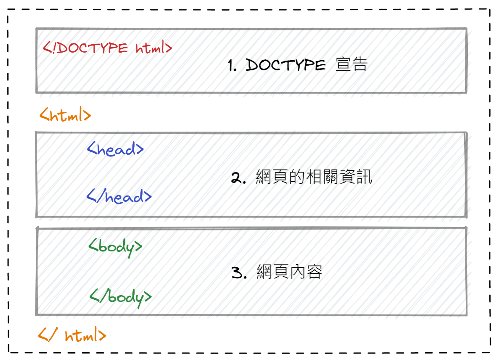
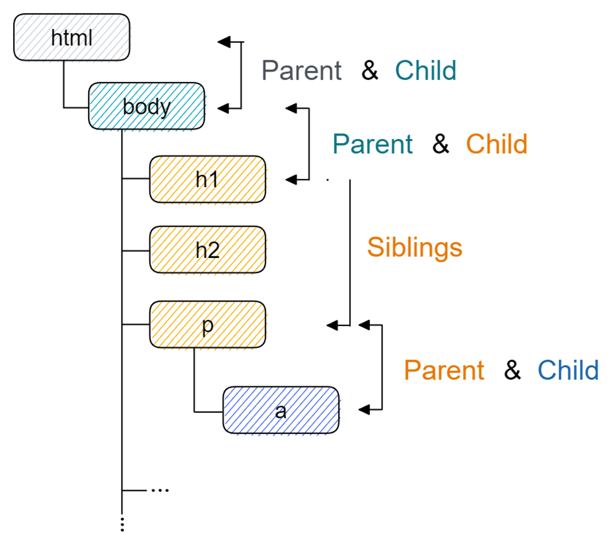
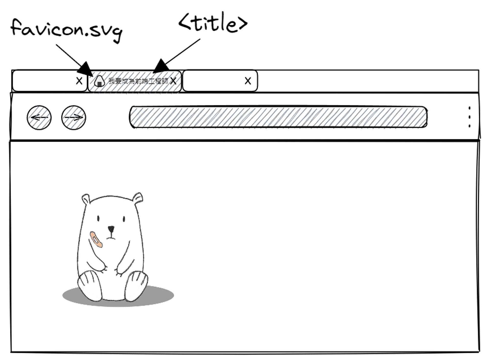

## HTML 的起源

- HTML ( HyperText Markup Language )

- 最初設計的目的 - 將電腦中文字與圖片用 一種固定的方式來呈現，並透過超連結的方式，將這些資料整合在一起。

- HTML 的發展

  

- HTML5

  - 在 2014 成為標準，也是目前 HTML 的最新版本

  - 涵蓋了 HTML + CSS + JS APIs

## HTML Element Tags ( 元素標籤 )

- 大多由以下三個部分組成

  

  - Ex. `<html></html>`、`<p></p>`、`<h1></h1>`

- 有部分單一標籤，不需要結束標籤

  - Ex. `<hr />`、`<meta />`、``

- 每個元素都有自己的預設樣式，須透過 CSS 美化

## HTML Properties ( 屬性 )

- 用來表示該元素的性質、功能、狀態 etc.

- 語法如下

  

  Ex. `<h2 id="heading" title="apple!">APPLE</h2>`

## HTML 文件架構

- HTML 基本架構

  

- HTML 文件，是由一層層巢狀的元素所組成的 `樹狀` 結構

  

- `<DOCTYPE>`

  - 寫在第一行

  - 告訴瀏覽器網頁使用的 HTML 版本

  - HTML4 有三種寫法

    ```html
    <!DOCTYPE html PUBLIC "-//W3C//DTD HTML 4.01//EN" "http://www.w3.org/TR/html4/strict.dtd">

    <!DOCTYPE html PUBLIC "-//W3C//DTD HTML 4.01 Transitional//EN" "http://www.w3.org/TR/html4/loose.dtd">

    <!DOCTYPE html PUBLIC "-//W3C//DTD HTML 4.01 Frameset//EN" "http://www.w3.org/TR/html4/frameset.dtd">
    ```

  - HTML5 統一使用 `<!DOCTYPE html>`

- `<html>` root element ( 根元素 )

  - 表示 HTML 文件的開頭 & 結尾，裡面包含了 `<head>` & `<body>`

  - 支援 `lang` 屬性，用來定義文件使用的語言，可以幫助搜尋引擎 & 瀏覽器做辨識

    ```html
    <!-- 表示網頁的語言是使用台灣的繁體中文 -->
    <html lang="zh-Hant-TW"></html>
    ```

    `zh` - 中文 / `Hant` - 字體 / `TW` - 地區

- `<head>`

  ```html
  <head>
    <meta charset="UTF-8" />
    <title>Example document</title>
    <style>
      /* Write CSS  here */
    </style>
    <script>
      // JavaScript code
    </script>
  </head>
  ```

  - 用來放一些描述網頁的資料 ( metadata )，元素裡的內容 ( 除了 title 以外 ) 不會顯示在網頁上

  - `title` - 網頁文件的標題，會出現在瀏覽器標籤左上角 ( 只能有一個 )

    

  - `meta` - 描述 HTML 問見資訊，內容由 `name` & `content` 屬性來決定 ( 對 SEO 非常重要 )

    ```html
    <head>
      <meta charset="utf-8" />
      <title>HTML 教學網</title>
      <meta name="author" content="sherman" />
      <meta name="keywords" content="HTML,CSS,JavaScript" />
      <meta name="date" content="2023/2/28" />
      <meta name="description" content="HTML 教學網站" />
      <meta name="generator" content="Microsoft Expression Web" />
      <meta http-equiv="Refresh" content="300" />
      <meta http-equiv="Refresh" content="20; url=http://tw.yahoo.com" />
    </head>
    ```

    `charset` - 定義網頁的字元編碼方式

    ```html
    <!-- 也可能會看到比較長的寫法 -->
    <meta http-equiv="Content-Type" content="text/html" ; charset="utf-8" />
    ```

    `name` - Meta 資料項目 ( Ex. `author`、`description`、`keywords` ... )

    `content` - Meta 資料內容

    `http-equiv` - 預先定義文件的某些狀態

  - `style` - 宣告樣式

  - `script` - 宣告程式碼

- `<body>`

  - 主要用來呈現網頁的內容，與網頁有關的內容都寫在這裡
