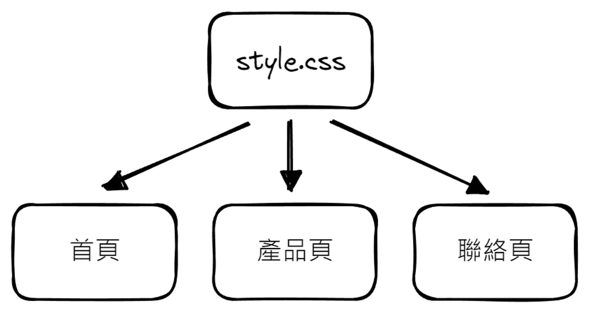
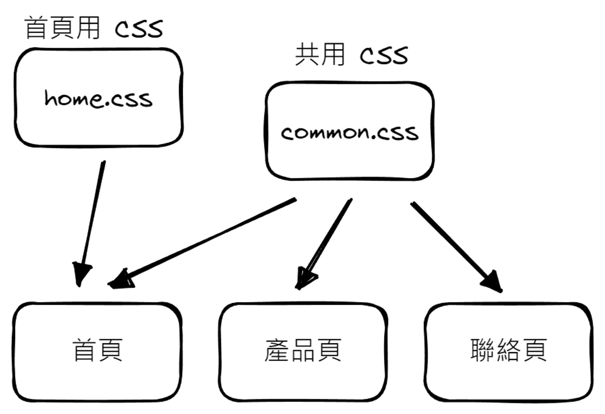
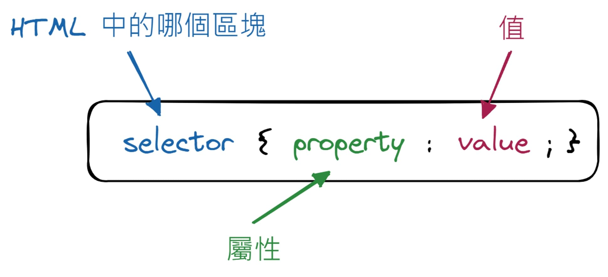
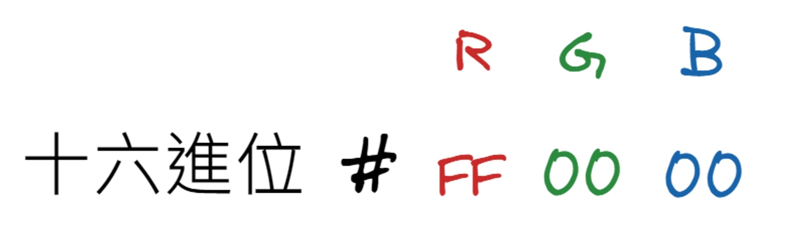

## 關於 CSS

- CSS ( Cascading Style Sheets ) 用來美化網頁，做版面設計的語言

- 以下為 CSS 的主要用途

  - 設定文字段落樣式 ( 字型大小、樣式、行距、字距、縮排、對齊方式 ... )
  - 設定顏色 ( 前景色、背景色 ... )
  - 調整版面 ( 區塊大小、留白、段落 ... )
  - 美化元素 ( 陰影、圓角、漸層、背景圖 ... )
  - 調整元素外觀 ( 放大縮小、旋轉、傾斜、翻轉 ... )
  - 動畫效果 ( 轉場效果 ... )
  - 依特定條件變化顯示樣式 ( Media Queries ... )

- 套用 CSS 的幾種方式

  1. 利用 HTML 的 `style` 屬性 ( 較常用在動畫操作 )

     ```html
     <h1 style="color: #fff;">標題 1</h1>
     ```

  2. 利用 `<style>` 標籤 ( 較少用 )

     ```html
     <head>
       <style>
         h1 {
           color: #fff;
         }
       </style>
     </head>
     ```

  3. 載入 CSS 檔案 ( 最常用 )

     ```html
     <!-- 方法一 -->
     <head>
       <style>
         /* 也可用在 .css 檔中 */
         @import url(CSS 檔案路徑);
       </style>
     </head>

     <!-- 方法二 ( 較常用 ) -->
     <head>
       <link href="CSS 檔案路徑" rel="stylesheet" media="all" />
       <!-- 
          href: 指定 CSS 路徑 
          rel: 指定載入的檔案類型，如果是載入 CSS，會固定寫成 stylesheet
          media: 指定適用此 CSS 檔的媒體種類 ( screen、print、speech、all )
       -->
     </head>
     ```

     好處 - 可以在多處引用，集中管理樣式，只需維護單一檔案

     

     比較龐大的網站中，習慣依不同角色分配不同支 CSS 做管理

     

## CSS Syntax

- 「哪個區塊」、「哪個屬性」要「怎麼顯示」( Ex. `h1 {color: #fff;}` )

  

- 註解 - `/* Comments */` ( 適當加入註解提示功能，能利於之後維護 )

- 顏色

  - 一般使用十六進位的 RGB 值 ( 00 ~ FF )

    

  - rgb/rgba - 三原色區間 0 - 255 ( 十進制 )

    - `rgba(red, green, blue, alpha)` ( alpha 為透明度 )

  - 其他 Ex. HEX、HSL、HSLA

- 單位

  - 最常使用的為 `rem`、`px`、`%`

  - 絕對單位

    | unit | description              |
    | ---- | ------------------------ |
    | px   | 螢幕中的像素點 ( pixel ) |
    | pt   | 一個 point ( 1/72 吋 )   |
    | pc   | 一個 picas ( 12 pt )     |
    | mm   | 公厘                     |
    | cm   | 公分                     |
    | in   | 英吋 (2.54 cm)           |

  - 相對單位

    | unit | description                           | side note                                            |
    | ---- | ------------------------------------- | ---------------------------------------------------- |
    | %    | <mark>父元素</mark> px 的「百分比」   |                                                      |
    | em   | <mark>最近父元素</mark> px 的「倍數」 | 較難掌控大小，因此使用上有越來越少的趨勢             |
    | rem  | <mark>根元素</mark> px 的「倍數」     | 根元素預設為 `16px`，可將其為 `6.25%` 讓後續較好計算 |

    ```html
    <!-- em 與 rem 的差異 -->
    <style>
      html {
        font-size: 16px;
      }
      li {
        font-size: 1.2em;
        font-size: 1.2rem;
      }
    </style>

    <ul>
      <!-- em: 16 * 1.2 = 19.2px -->
      <!-- rem: 16 * 1.2 = 19.2px -->
      <li>Layer 1</li>
      <li>Layer 1</li>
      <ul>
        <!-- em: 19.2 * 1.2 = 23.04px -->
        <!-- rem: 16 * 1.2 = 19.2px -->
        <li>Layer 2</li>
      </ul>
    </ul>
    ```

## `media`

## box model (box-sizing)

## normalize

## how css works

## webkit

## browser, media support
