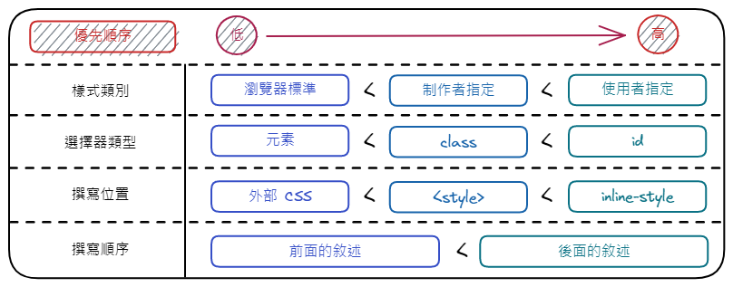
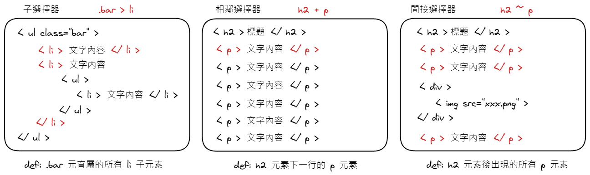

## Basic Selectors

- 前面已經看過使用元素本身作為選擇器，但實作上常常會重複使用到同一個元素，而並非每個元素都像要相同的樣式。就算一開始相同，後續維運上也有可能做微調。

  ```html
  <h2>Hello World</h2>

  <style>
    h2 {
      color: #fff;
    }
  </style>
  ```

- `id`

  ```html
  <main id="contents">
    <section id="intro">
      <h2 class="section-title">自我介紹</h2>
      <p class="section-content">我是一隻貓</p>
    </section>
  </main>

  <style>
    #contents {
      /* ... */
    }

    #intro {
      /* ... */
    }
  </style>
  ```

  - 在 CSS 中，加上 `#` 來選取對應 `id` 屬性的元素
  - 用來識別 HTML 中特定位置的屬性，同一個名稱在 HTML 檔案中，只能出現一次
  - 使用多個將會造成語法上的錯誤 ( 後續 JavaScript 取用時也會出現問題 )

- `class`

  ```html
  <main id="contents">
    <section id="intro">
      <h2 class="section-title">自我介紹</h2>
      <p class="section-content">我是一隻貓</p>
    </section>

    <section id="projects">
      <h2 class="section-title">作品</h2>
      <p class="section-content">以下是我的作品</p>
    </section>
  </main>

  <style>
    .section-title {
      /* ... */
    }

    .section-content {
      /* ... */
    }
  </style>
  ```

  - 在 CSS 中，加上 `.` 來選取對應 `class` 屬性的元素
  - 用於會重複出現的元素樣式，可以加在需要此樣式的元素上

## 元素之間的關係

- `子孫選擇器` - 用空格格開，所有滿足條件的子孫都會被選取

  ```html
  <div class="img-container">
    
  </div>

  <style>
    .img-container img {
      /* ... */
    }
  </style>
  ```

- `相鄰選擇器` - 用 `+` 選取某元素 <mark>直接相鄰</mark> ( 下一個 ) 的兄弟元素

  ```html
  <section id="intro" class="section-block">
    <!-- ... -->
  </section>

  <section id="projects" class="section-block">
    <!-- ... -->
  </section>

  <style>
    .section-block + .section-block {
      /* 讓 section 和 section 之間加上間距 */
      margin-top: 30px;
    }
  </style>
  ```

- `子選擇器` - 用 `>` 選取 <mark>直屬於</mark> ( 下一層 ) 某元素的子元素

  ```html
  <main id="contents">
    <!-- 直屬於 #contents 的會生效 -->
    <section id="intro">
      <!-- 非直屬，不生效 -->
      <section class="sub-section">...</section>
      <section class="sub-section">...</section>
    </section>

    <!-- 直屬於 #contents 的會生效 -->
    <section id="projects">
      <!-- 非直屬，不生效 -->
      <section class="sub-section">...</section>
      <section class="sub-section">...</section>
    </section>
  </main>

  <style>
    #contents > section + section {
      margin-top: 30px;
    }
  </style>
  ```

- `樣式覆蓋` - 緊緊相連 ( 常用在標記特定狀態 )

  ```html
  <ul class="menu">
    <li class="active">關於我</li>
    <li>我的作品</li>
    <li>聯絡我</li>
  </ul>

  <style>
    .menu {
      /* ... */
    }

    .menu > li {
      /* ... */
    }

    .menu > li.active {
      /* ... */
    }
  </style>
  ```

- 瀏覽器會 <mark>從右至左</mark> 篩選比對元素

  ```css
  /* 瀏覽器閱讀方式: li > ul > #nav */
  #nav ul li {
    /* ... */
  }

  /* 1. 找到所有 li */
  /* 2. 從中找出被 ul 包住的 */
  /* 3. 從中找出被 #nav 包住的 */
  ```

## 群組選擇器

- 多個選擇器套用相同的樣式，使用 `,` 隔開

  ```css
  <style>
    .header,.main,.footer {
      /* ... */
    }
  </style>
  ```

## Pseudo Class 虛擬 (偽) 類選擇器

- 元素在特定情況才會生效的效果

  ```css
  a {
    color: #000;
  }

  /* 滑鼠移上去時生效 */
  a:hover {
    color: #fff;
  }
  ```

- 用於連結 `<a>` 的偽類選擇器

  | Syntax     | Description  |
  | ---------- | ------------ |
  | `:link`    | 未連過的連結 |
  | `:visited` | 曾連過的連結 |
  | `:hover`   | 滑鼠移入時   |
  | `:active`  | 點按滑鼠時   |
  | `:focus`   | 取得焦點時   |

## Pseudo Element 偽元素

- 藉由偽元素，可以不用在 HTML 加上一些多餘的裝飾元素

  ```css
  .see-more::after {
    /* 一定要加 content ! 可以不放東西 */
    content: url(img/icon_arrow.png);
    margin-left: 3px;
  }
  ```

## 屬性選擇器

- 可以使用 `[]` 指定某些屬性值來選取元素

  ```css
  /* 選取 target 為 _blank 的 a 標籤 */
  a[target="_blank"] {
    /* ... */
  }
  ```

## 選擇器的優先順序

- 當有多個選擇器，同時設置了某個屬性時，就會依照此機制處理
- 基本上，<mark>寫在後面的，會優先於寫在前面的</mark>
- 另一個影響優先度的，為選擇器的 <mark>明確度</mark>

  - 元素選擇器 < class 選擇器 < id 選擇器
  - 外部 CSS < 在 HTML 用 `<style>` 標籤撰寫 < inline-style

- 概略整理

  

- `!important`

  - 除了明確度外，<mark>直接指定</mark> 他為最優先

    ```css
    /* 原本的優先順序 */
    #box .box-item {
      color: red; /* 優先 */
    }

    .box-item {
      color: blue;
    }

    /* 指定 !important 後的優先順序 */
    #box .box-item {
      color: red;
    }

    .box-item {
      color: blue !important; /* 優先 */
    }
    ```

  - `!important` 只用在沒有其他更好方法時使用，不要胡亂使用而破壞了 CSS 原本的規則

## 選擇器總整理

- 基礎選擇器

  | Selector                                                          | Name         | Definition                          | Example                        |
  | ----------------------------------------------------------------- | ------------ | ----------------------------------- | ------------------------------ |
  | [`*`](https://www.w3schools.com/cssref/sel_all.php)               | 通用選擇器   | 選擇所有元素                        | `* { margin: 0; }`             |
  | [`E`](https://www.w3schools.com/cssref/sel_element.php)           | 元素選擇器   | 選擇指定元素 ( E )                  | `h1 { color: #fff; }`          |
  | [`#id`](https://www.w3schools.com/cssref/sel_id.php)              | id 選擇器    | id 屬性為 [id 值] 的元素            | `#title { font-size: 150%; }`  |
  | [`.class`](https://www.w3schools.com/cssref/sel_class.php)        | class 選擇器 | class 屬性為 [class 值] 的元素      | `.note { font-size: 80%; }`    |
  | `E F`                                                             | 子孫選擇器   | 選擇父元素 E 下的子元素 F           | `h1 span { color: #fff; }`     |
  | [`E > F`](https://www.w3schools.com/cssref/sel_element_gt.php)    | 子選擇器     | 選擇父元素 E 的直接子元素 F         | `ul > li { padding: 5px; }`    |
  | [`E + F`](https://www.w3schools.com/cssref/sel_element_pluss.php) | 相鄰選擇器   | 選擇兄元素 E 的直接相鄰的弟元素 F   | `h2 + p { margin-top: 15px; }` |
  | [`E ~ F`](https://www.w3schools.com/cssref/sel_gen_sibling.php)   | 間接選擇器   | 選擇兄元素 E 之後登場的所有弟元素 F | `h2 ~ p { text-indent: 1em }`  |

  

- 屬性選擇器

  | Selector                                                                                | Definition                                                                      | Example              |
  | --------------------------------------------------------------------------------------- | ------------------------------------------------------------------------------- | -------------------- |
  | [`E[attr]`](https://www.w3schools.com/cssref/sel_attribute.php)                         | 選擇所有有屬性 attr 的 E 元素                                                   | `a[href]`            |
  | [`E[attr="value"]`](https://www.w3schools.com/cssref/sel_attribute_value.php)           | 選擇有屬性 attr 且值為 value 的 E 元素                                          | `a[target="_blank"]` |
  | [`E[attr^="value"]`](https://www.w3schools.com/cssref/sel_attr_begin.php)               | 選擇有屬性 attr 且值為 value <mark>開頭</mark> 的 E 元素                        | `a[href^="mailto:"]` |
  | [`E[attr$="value"]`](https://www.w3schools.com/cssref/sel_attr_end.php)                 | 選擇有屬性 attr 且值為 value <mark>結束</mark> 的 E 元素                        | `a[href$=".pdf"]`    |
  | [`E[attr*="value"]`](https://www.w3schools.com/cssref/sel_attr_contain.php)             | 選擇有屬性 attr 且值為 <mark>包含</mark> value <mark>substring</mark> 的 E 元素 | `[class*="icon_"]`   |
  | [`E[attr~="value"]`](https://www.w3schools.com/cssref/sel_attribute_value_contains.php) | 選擇有屬性 attr 且值為 <mark>包含</mark> value <mark>單字</mark> 的 E 元素      | `[title~="flower"]`  |
  | [`E[attr\|="value"]`](https://www.w3schools.com/cssref/sel_attribute_value_lang.php)    | 選擇有屬性 attr 且值為 value 或由 value 開頭的 E 元素                           | `[lang\|="en"]`      |

- 虛擬類別選擇器

  | Type | Selector                                                                             | Definition                             | Common |
  | ---- | ------------------------------------------------------------------------------------ | -------------------------------------- | ------ |
  | 狀態 | [`:link`](https://www.w3schools.com/cssref/sel_link.php)                             | 未連過的連結 ( `<a>` 限定 )            | ✅     |
  | 狀態 | [`:visited`](https://www.w3schools.com/cssref/sel_visited.php)                       | 曾連過的連結 ( `<a>` 限定 )            | ✅     |
  | 狀態 | [`E:hover`](https://www.w3schools.com/cssref/sel_hover.php)                          | 滑鼠移入 E 元素時                      | ✅     |
  | 狀態 | [`E:active`](https://www.w3schools.com/cssref/sel_active.php)                        | 在 E 元素上點按滑鼠時                  | ✅     |
  | 狀態 | [`E:focus`](https://www.w3schools.com/cssref/sel_focus.php)                          | E 元素獲得聚焦時                       | ✅     |
  | 狀態 | [`E:fullscreen`](https://www.w3schools.com/cssref/sel_fullscreen.php)                | 選取在 fullscreen 狀態的 E 元素        |        |
  | 語言 | [`E:lang`](https://www.w3schools.com/cssref/sel_lang.php)                            | 有指定某文字邊把的 E 元素              |        |
  | 結構 | [`E:first-child`](https://www.w3schools.com/cssref/sel_firstchild.php)               | 第一個子元素 E                         | ✅     |
  | 結構 | [`E:last-child`](https://www.w3schools.com/cssref/sel_last-child.php)                | 最後的子元素 E                         | ✅     |
  | 結構 | [`E:nth-child(n)`](https://www.w3schools.com/cssref/sel_nth-child.php)               | 第 n 個子元素 E                        | ✅     |
  | 結構 | [`E:nth-last-child(n)`](https://www.w3schools.com/cssref/sel_nth-last-child.php)     | 倒數第 n 個子元素 E                    |        |
  | 結構 | [`E:only-child`](https://www.w3schools.com/cssref/sel_only-child.php)                | 唯一的子元素 E                         |        |
  | 結構 | [`E:first-of-type`](https://www.w3schools.com/cssref/sel_first-of-type.php)          | 第一個 E 元素                          |        |
  | 結構 | [`E:last-of-type`](https://www.w3schools.com/cssref/sel_last-of-type.php)            | 最後一個 E 元素                        |        |
  | 結構 | [`E:nth-of-type(n)`](https://www.w3schools.com/cssref/sel_nth-of-type.php)           | 第 n 個 E 元素                         | ✅     |
  | 結構 | [`E:nth-last-of-type(n)`](https://www.w3schools.com/cssref/sel_nth-last-of-type.php) | 倒數第 n 個 E 元素                     |        |
  | 結構 | [`E:only-of-type`](https://www.w3schools.com/cssref/sel_only-of-type.php)            | 唯一的 E 元素                          |        |
  | 結構 | [`:root`](https://www.w3schools.com/cssref/sel_root.php)                             | 文檔的根元素 (html 元素)               | ✅     |
  | 結構 | [`E:empty`](https://www.w3schools.com/cssref/sel_empty.php)                          | 選取沒有 children (包括文字) 的 E 元素 |        |
  | 否定 | [ `E:not(s)`](https://www.w3schools.com/cssref/sel_not.php)                          | 不含 s 選擇器的 E 元素                 | ✅     |
  | 目標 | [`E:target`](https://www.w3schools.com/cssref/sel_target.php)                        | 目標元素 E                             |        |
  | UI   | [`E:default`](https://www.w3schools.com/cssref/sel_default.php)                      | 選取表單元素的預設選項                 |        |
  | UI   | [`E:enabled`](https://www.w3schools.com/cssref/sel_enabled.php)                      | 可輸入資料的 E 元素                    | ✅     |
  | UI   | [`E:disabled`](https://www.w3schools.com/cssref/sel_disabled.php)                    | 無法輸入資料的 E 元素                  | ✅     |
  | UI   | [`E:valid`](https://www.w3schools.com/cssref/sel_valid.php)                          | 輸入內容 valid 的表單元素              | ✅     |
  | UI   | [`E:required`](https://www.w3schools.com/cssref/sel_required.php)                    | 選取 `required` 的表單元素             | ✅     |
  | UI   | [`E:optional`](https://www.w3schools.com/cssref/sel_optional.php)                    | 選取沒有 `required` 的表單元素         |        |
  | UI   | [`E:read-only`](https://www.w3schools.com/cssref/sel_read-only.php)                  | 選取有 `read-only` 的表單元素          |        |
  | UI   | [`E:read-write`](https://www.w3schools.com/cssref/sel_read-write.php)                | 選取沒有 `read-only` 的表單元素        |        |
  | UI   | [`E:checked`](https://www.w3schools.com/cssref/sel_checked.php)                      | 以選取的 E 元素 (選項)                 | ✅     |

- 虛擬元素

  | Selector                                                                  | Definition                 | Example                                     | Common |
  | ------------------------------------------------------------------------- | -------------------------- | ------------------------------------------- | ------ |
  | [`E::before`](https://www.w3schools.com/cssref/sel_before.php)            | 在 E 元素前面的內容        | `p::before { content: "『"; }`              | ✅     |
  | [`E::after`](https://www.w3schools.com/cssref/sel_after.php)              | 在 E 元素後面的內容        | `p::after { content: "』"; }`               | ✅     |
  | [`E::first-letter`](https://www.w3schools.com/cssref/sel_firstletter.php) | E 元素的第一個字母         | `p::first-letter { font-size: 200%; }`      |        |
  | [`E::first-line`](https://www.w3schools.com/cssref/sel_firstline.php)     | E 元素的第行               | `p::first-line { font-weight: bold; }`      |        |
  | [`E::selection`](https://www.w3schools.com/cssref/sel_selection.php)      | E 元素中使用者選擇的區域   | `p::selection { background-color: #eee;  }` |        |
  | [`::marker`](https://www.w3schools.com/cssref/sel_marker.php)             | 選取 `<li>` 的 marker      | `li::marker { color: #eee;  }`              |        |
  | [`E::placeholder`](https://www.w3schools.com/cssref/sel_placeholder.php)  | 選取表單元素的 placeholder | `input::placeholder { color: #eee;  }`      | ✅     |
