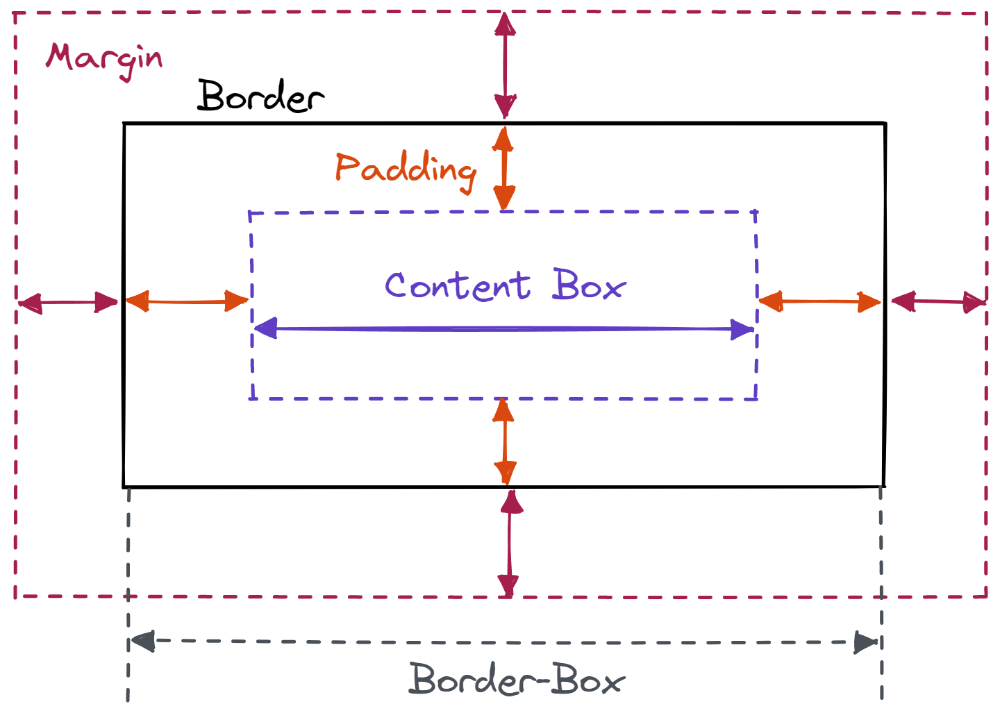
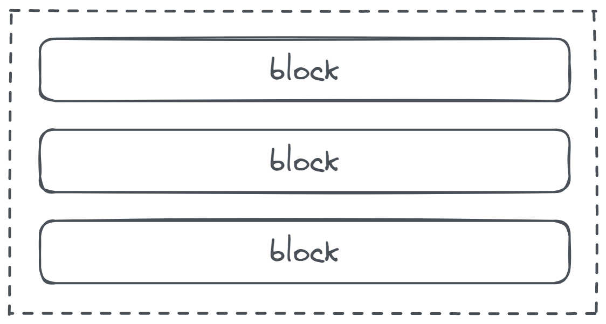
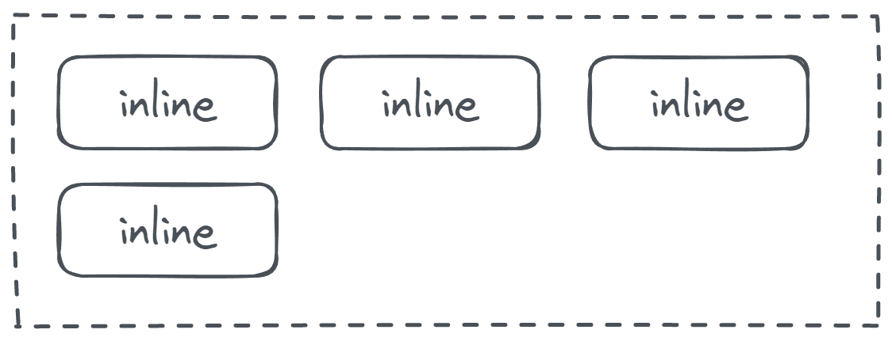
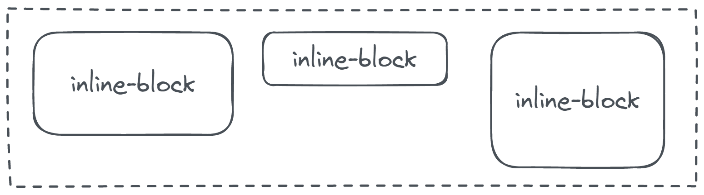
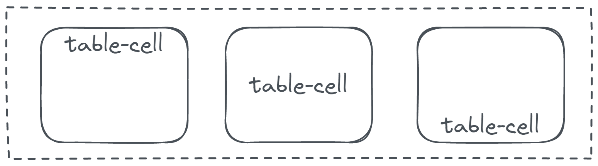

## Box Model

- HTML 的元素，可以視為一個盒子，而當中 `width`、`height`、`padding`、`border`、`margin` 等屬性之間的關係，就稱為 Box Model

- Box Model 概念圖

  

- 重點在於 `width` 和 `height` 是指哪個區域

  > 過去 `width` 指的是 `content-box`，現在可以透過 `box-sizing` 修改

  - `content-box` - 扣除 `padding`、`border`、`margin` 後的區域 (default)

    ```css
    /* 目標寬度: 960px */
    div {
      width: 930px; /* 960 - (5*2) - (10*2) */

      margin: 15px;
      padding: 10px;
      border: 5px solid #000;
    }
    ```

  - `border-box` - 扣除 `margin` 後的區域 ( 較好控制，不需要加加減減 )

    ```css
    /* 目標寬度: 960px */
    div {
      box-sizing: border-box;

      width: 960px; /* 960 */

      margin: 15px;
      padding: 10px;
      border: 5px solid #000;
    }

    /* Content Box 目前大小 = 960 - (5*2) - (10*2) = 930 */
    ```

## Display

- 用來控制元素的顯示特徵

- 常見屬性種類

  - `block` ( Ex. `div`、`ul`、`dl`、`p`、`h1 - h6` etc. )

    

    - 具有寬高 ( `width` / `height` ) 的概念
    - 可設定上下左右的 `margin` 和 `padding`
    - 預設由上而下做 <mark>換行</mark> 配置
    - <mark>無法</mark> 設置 `vertical-align`，無法設至內容垂直對齊方式，永遠靠上對齊

  - `inline` ( Ex. `span`、`a`、`img`、`strong` etc. )

    

    - <mark>沒有</mark> 寬高 ( `width` / `height` ) 的概念
    - <mark>無法</mark> 設定 <mark>上下</mark> 的 `margin`
    - 預設如同文字一樣，會並排排列 ( 除非使用 `<br>` 做斷行 )
    - 可利用 <mark>父層</mark> 的 `text-align` 做靠左、靠右、置中對齊
    - 可以設置 `vertical-align`，和相鄰的文字或 `inline` 元素作置中對齊

  - `inline-block`

    

    - 與 `inline` 一樣，元素前後不會自動換行，以水平方向排列
    - 與 `block` 一樣，可設定 `width` / `height` 和 `margin` / `padding` 的概念
    - 可利用 <mark>父層</mark> 的 `text-align` 做靠左、靠右、置中對齊
    - 可以設置 `vertical-align`，和相鄰的文字或 `inline` 元素作置中對齊

  - `table-cell` ( Ex. `th`、`td` )

    

    - 設置後，會和儲存格一樣，橫排顯示
    - 相鄰元素的高度會自動調整為與 <mark>高度最大</mark> 的相同
    - 可利用 `vertical-align`，設置 <mark>內容</mark> 的垂直對齊方式

  - `none`
    - 將元素隱藏不顯示
    - 因元素被視為「不存在」，<mark>不會</mark> 保留原本區域，後面的元素會自動補上

## 常見的屬性

> 撰寫時，盡量將相關的屬性集中在一起

- 顏色

  | Property           | Value | Description             |
  | ------------------ | ----- | ----------------------- |
  | `background-color` | 色碼  | 背景色                  |
  | `color`            | 色碼  | 文字、線條顏色 (前景色) |

- 字形、文字排列
  | Property | Value | Description |
  | ------------------ | ----- | ----------------------- |
  | `font-family` | 字型種類 | 字型名稱 |
  | `font-size` | 字體大小 | 含單位的數值 |
  | `font-weight` | 字體粗細 | `normal`、`bold`、`light`、`lighter`、數值 |
  | `font-style` | 字體樣式 | `normal`、`italic` |
  | `text-align` | 對齊方式 | `left`、`center`、`right`、`justify` |
  | `text-decoration` | 底線、上劃線、刪除線 | `none`、`underline`、`overline`、`line-through` |
  | `text-indent` | 文字縮排 | 含單位的數值 |
  | `letter-spacing` | 字距 | 含單位的數值 |
  | `line-height` | 行高 | 建議使用不含單位的數值 |

  - TODO : 補充
    - `font-family`
    - `line-height`

- 元素區塊
  | Property | Value | Description |
  | ------------------ | ----- | ----------------------- |
  | `width` | 元素寬度 | `auto` / 含單位的數值 |
  | `height` | 元素高度 | `auto` / 含單位的數值 |
  | `margin` | 框線外側邊界 | `auto` / 含單位的數值 |
  | `padding` | 框線內側邊界 | 含單位的數值 |
  | `border` | 框線 | 框線寬度、框線種類、框線顏色 |

## 屬性「繼承」&「覆寫」

> 善用預設值或繼承的屬性值，避免出現不必要的定義、敘述

- 「繼承」

  - 指的是在元素中設定某些屬性後，子元素也會「繼承」到這些屬性
  - 大致狀況如下 ( 實際狀況還是查閱文件較準 )

  - 和 <mark>文字</mark>、<mark>段落</mark> 有關的屬性 <mark>會</mark> 被繼承
  - 上述以外的屬性，<mark>大多不會</mark> 被繼承

  ```html
  <section>
    <h2>h2 標題</h2>
    <p>元素內容</p>
  </section>

  <style>
    section {
      /* 不會繼承 */
      border: 1px solid #fff;

      /* 會繼承 (文字相關) */
      color: #73abe3;
      text-decoration: underline;
      text-align: center;
    }
  </style>
  ```

- 「覆寫」

  - CSS 由上而下依序載入，因此當同一個屬性被設置不同的值時，後面的值會覆寫前面的值
  - 可以在子元素重新定義來「<mark>覆寫</mark>」掉繼承過來的屬性值

  ```css
  h2 {
    border: 1px dotted #000;

    /* 覆寫 border-left 的值 */
    border-left: 10px solid #eee;
  }
  ```

## normalize

- 由於 HTML 預設的樣式常常造成切版上的不便，因此常會在一開始做統一的覆寫

- 常見做法 ( [參考文章](https://israynotarray.com/css/20210807/3641451940/) )

  - 引入 [reset.css](https://meyerweb.com/eric/tools/css/reset/)
    - 覆寫 <mark>全部</mark> 樣式
  - 引入 [normalize.css](https://necolas.github.io/normalize.css/)
    - 保留預設樣式 ( 也支援 HTML5 )
    - 修正瀏覽器本身的 Bug
    - 清楚的註解
  - 自己寫 ( 以下是 [常見的寫法](https://www.joshwcomeau.com/css/custom-css-reset/) )

    ```css
    /* 1. Use a more-intuitive box-sizing model. */
    *,
    *::before,
    *::after {
      box-sizing: border-box;
    }

    /* 2. Remove default margin */
    * {
      margin: 0;
    }

    /* 3. Allow percentage-based heights in the application */
    html,
    body {
      height: 100%;
    }

    /*
      Typographic tweaks!
      4. Add accessible line-height
      5. Improve text rendering
    */
    body {
      line-height: 1.5;
      -webkit-font-smoothing: antialiased;
    }

    /* 6. Improve media defaults */
    img,
    picture,
    video,
    canvas,
    svg {
      display: block;
      max-width: 100%;
    }

    /* 7. Remove built-in form typography styles */

    input,
    button,
    textarea,
    select {
      font: inherit;
    }

    /* 8. Avoid text overflows */
    p,
    h1,
    h2,
    h3,
    h4,
    h5,
    h6 {
      overflow-wrap: break-word;
    }

    /* 9. Create a root stacking context */
    #root,
    #__next {
      isolation: isolate;
    }
    ```
