🔹 預設的區塊元素，會由上到下排列。了解各種元素的性質，能避免定義多餘的屬性!<br>
🔹 一開始練習的時候，盡量一邊切一邊查看畫面的變化，幫助自己在腦海連結畫面和程式碼

## `float`

- 常用來製作文繞圖 ( 因為蠻常見，也可以設成 class 重複使用 )

  ```css
  /* 靠左 / 靠右 */
  float: left | right;
  ```

  - 加上後文字就會避開圖片，繞著相反的方向以文繞圖顯示

- 使用 `float` 很容易使 <mark>版面大幅錯位</mark>

  - 在沒有解除文繞圖的情況下，只要留有空白，後面的元素會一起被拉上來補位

    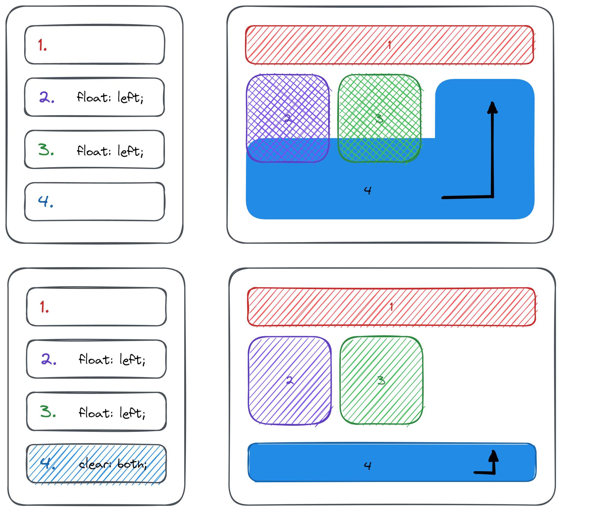

  - 在文繞圖後使用 `clear` 來解決

    ```css
    /* 可以建立一個 class 重複使用 */
    .clearfix {
      clear: both;
    }
    ```

- 解除 `float` 時的問題

  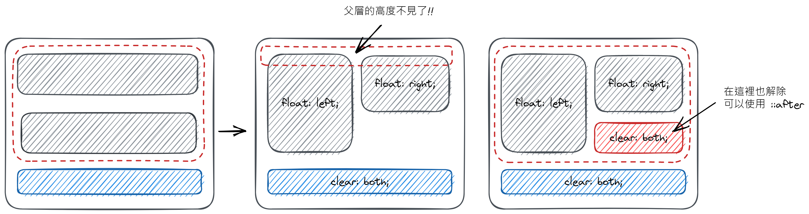

  - `float` 的特性為，「當子元素設為 `float` 時，包住他的父元素將視為 <mark>無高度</mark>」，<br>因此需在父層需到父層後面清除 ( 習慣使用 `::after` 處理 )

    ```css
    /* 放在 float container 上 */
    .clearfix::after {
      content: "";
      display: block;
      clear: both;
    }
    ```

  - 也可以在 float container 上使用 `overflow: hidden;` 解決 ( 就結論而言 )

    > 本身是用來處理內容超出尺寸時的顯示方式，並非用來解除 float

    ```css
    /* 複習 overflow 屬性 */

    overflow: auto | scroll | hidden | visible;

    /*
      auto: 自動判斷是否顯示滾軸
      scroll: 固定顯示滾軸
      hidden: 不顯示滾軸，隱藏超出範圍的內容
      visible ( default ) : 不顯示卷軸，並顯示超出範圍的內容
    */
    ```

- 二欄式版面

  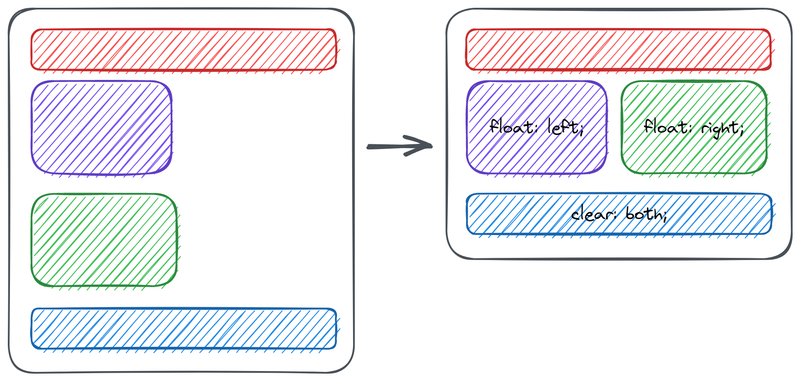

- 三欄式版面

  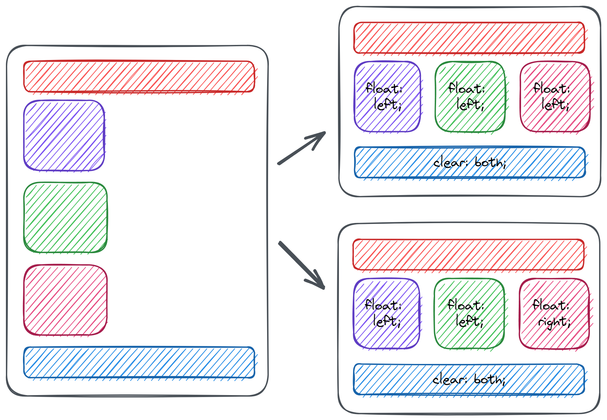

  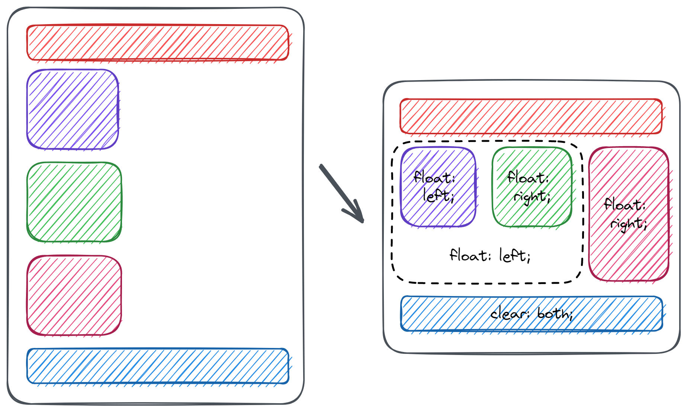

- 格狀排列

  

  - 搭配 `nth-child` 做 `margin`

- 使用 `float` 做版面時的注意 & 限制 ( 無法單靠 CSS )

  - 橫向區塊並不會自動拉成同高度
  - 橫向並列的區塊只能靠上對齊

## [`position`](https://www.w3schools.com/css/css_positioning.asp)

- 一般來說，元素的顯示順序，會依照在 HTML 中的順序相同，<br>但使用 `position` 就能無視原本的排列順序

  ```css
  position: static (default) | absolute | relative | fixed | sticky;
  ```

- `position` 用來指定顯示位置，預設值為 `static`，改成 `absolute` ( 絕對位置 ) 後能自由調整位置

  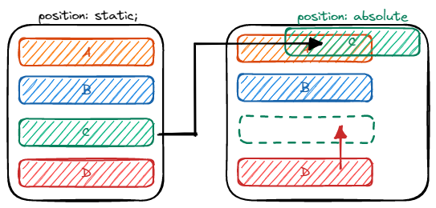

- 元素被設為 `absolute` 後，原本應該顯示的位置，會由後續的元素補上，<br>如同在原畫面上蓋上一個圖層

  > 加上 `absolute` 後仍會待在原位置，需透過 `top` 等屬性調整

  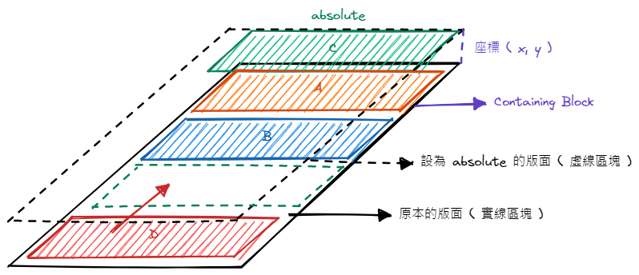

  > containing block 在沒有其他設置 `relative` 的情況下為 `body`

  ```css
  .c {
    position: absolute;
    top: 0;
    left: 0;

    /* 以下屬性，只有在非 static 時能使用 (可用負數) */
    /* top     - 離 containing block 上緣的 px */
    /* right   - 離 containing block 右緣的 px */
    /* bottom  - 離 containing block 下緣的 px */
    /* left    - 離 containing block 左緣的 px */
  }
  ```

- `relative`

  - 設置 containing block，提供 `absolute` 元素新的基準

  - 使用 `relative` 後，可以做上下左右的偏移，但和 `absolute` 的差別是，區塊原本的空間仍會被保留<br>( 也就是設置後如果沒有調整偏移，會長的和原本一樣 )

  - 也可以用來做區塊之間的重疊效果

    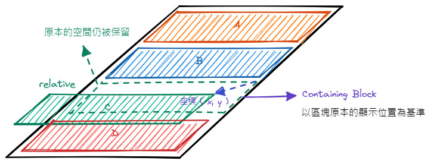

- 可使用 `z-index` 來調整元素之間重疊的順序

  - 多個 `position` ( 非 `static` ) 的設置預設會依照順序往上堆疊

  - 但可以將預設的版面 `z-index` 的值視為 `0`，因此設為 `-1` 時可以將元素移動到背後

- `fixed`

  - 一樣能以絕對位置去配置內容區塊，原本的空間也會被補上

  - 和 `absolute` 的差別在於 `fixed` 會以 `body` 元素 ( viewport ) 為基準，在捲動畫面的過程中，永遠固定在某個位置

    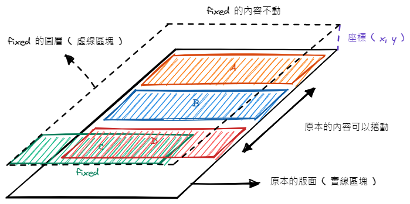

- `sticky`

  > safari 須加上 -webkit- 前綴

  > p.s 只會在父層容器還在畫面上時維持 `fixed`，若繼續 fixed 會超出容器，<br>則會回到 `relative` 並隨容器消失 ( ?????? )

  - 會依據使用者捲動畫面的位置，在 `relative` 和 `fixed` 之間做切換

  - 預設為 `relative`，在捲動畫面到指定 position 時，切換到 `fixed` 並繼續黏在那邊

- 補充

  - `position` 置中技巧

    ```css
    /* 欲將 content 置中到 container 正中央 */
    .container {
      position: relative;
      /* ... */
    }

    /* 可依據置中需求做數字上的調整 */
    .container .content {
      position: absolute;

      /* 水平 */
      left: 50%;
      transform: translateX(-50%);

      /* 垂直 */
      top: 50%;
      transform: translateY(-50%);

      /* 完全 */
      top: 50%;
      left: 50%;
      transform: translate(-50%);
    }
    ```

  - 版面使用情境

    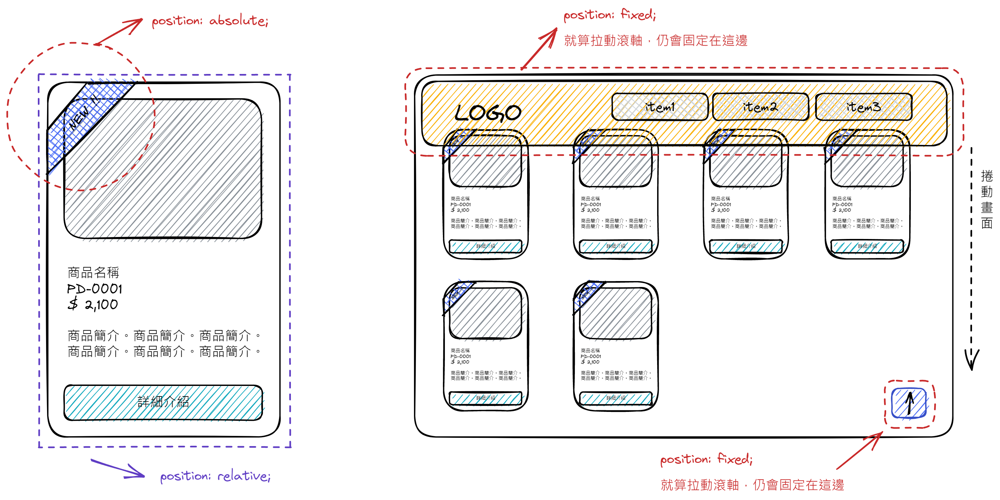

## [`flex`](https://www.w3schools.com/css/css3_flexbox.asp)

- 「Flexible Box Layout Module」，簡稱「Flexbox」，用來製作多欄式的版面

- 只要將元素設置 `display: flex;` 就會成為 flex 容器，而其 <mark>子</mark> 元素就為 flex 項目，可以透過各種關聯屬性對他們做設置

  > 不論原本的性質為何，flex 項目都會變為 `block`

  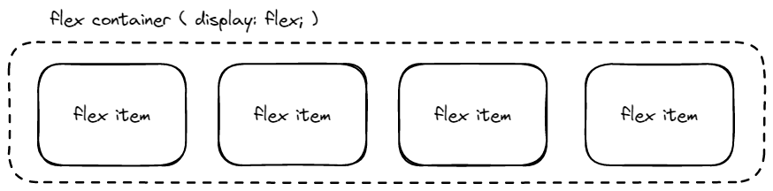

- 可將 flex 視為 主軸 & 交叉軸 的概念理解，可以使用 `flex-direction` 調整軸的方向和排列順序

  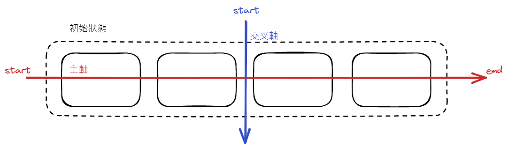

  ```css
  flex-direction: row (default) | row-reverse | column | column-reverse;

  /*  <主軸>
      row: 左 -> 右
      row-reverse: 右 -> 左
      column: 上 -> 下
      column-reverse: 下 -> 上
    */
  ```

  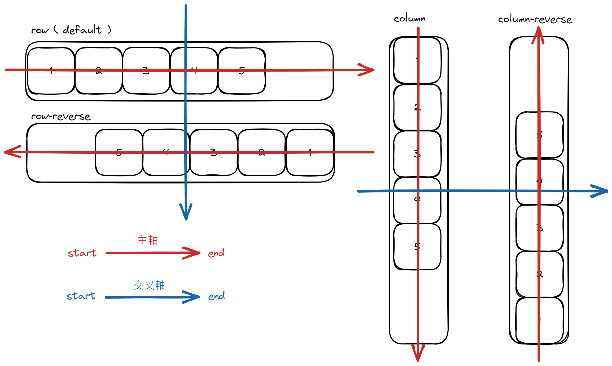

- 在父元素設置 `display: flex;` 後，預設情況

  - 預設會由左至右，並靠左排列

  - 子元素在沒有設置高度的情況下，會依據當中最高的為基準拉開至同高度

    > 如果有設置，則會依照設置的高度

    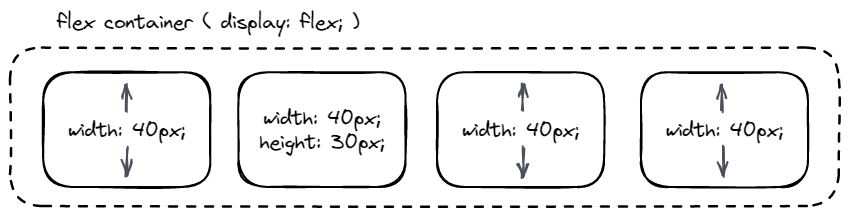

- 用 `justify-content` 控制 <mark>主軸</mark> 的對齊方式

  ```css
  justify-content: flex-start; /* 對齊前端 default */
  justify-content: flex-end; /* 對齊尾端 */
  justify-content: center; /* 對齊中央 */
  justify-content: space-around; /* 分散對齊 */
  justify-content: space-between; /* 分散對齊 */
  ```

  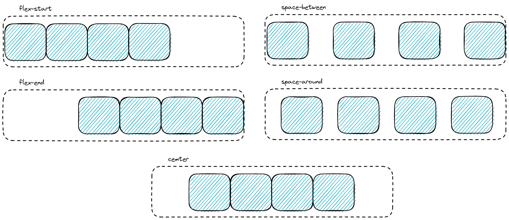

- 用 `align-items` 控制 <mark>交叉軸</mark> 的對齊方式

  ```css
  align-items: stretch; /* 自動對齊拉伸 default */
  align-items: flex-start; /* 對齊上端 */
  align-items: flex-end; /* 對齊尾端 */
  align-items: center; /* 對齊中央 */
  align-items: baseline; /* 對齊準線 */
  ```

  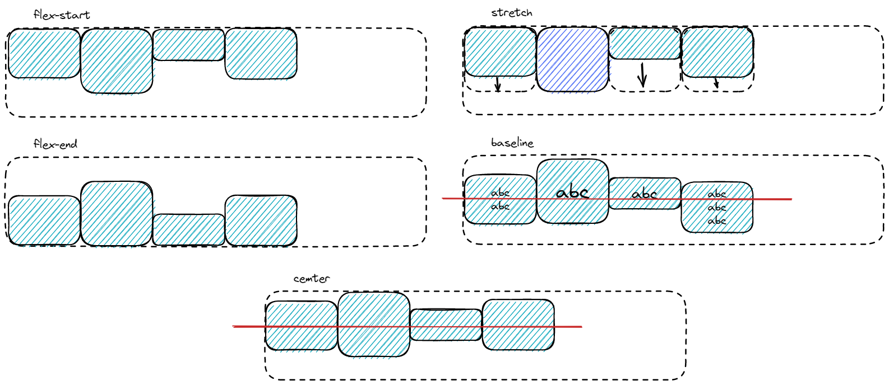

- `flex-wrap` - 控制 flex 項目的自動換行

  ```css
  flex-wrap: nowrap; /* 不換行 (default) */
  flex-wrap: wrap; /* 換行 (自動以多行顯示) */
  flex-wrap: wrap-reverse; /* 反轉換行 */
  ```

  - 預設情況下，flex 項目增加到 flex 容器放不下時，每個項目會 <mark>自動縮小</mark> 到能在容器中排成一列 ( 也就是不會自動換行 )

    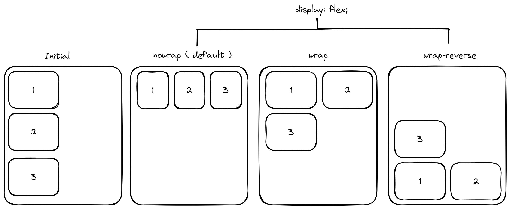

- `align-content` - 設定多行項目的排列方式 ( 搭配 `flex-wrap` )

  > 使用時要確保交叉軸有足夠的空間

  ```css
  align-content: stretch; /* 自動拉伸 (沒設高的情況下為 default) */
  align-content: flex-start; /* 對齊上端 */
  align-content: flex-end; /* 對齊尾端 */
  align-content: center; /* 對齊中央 */
  align-content: space-around; /* 分散對齊 */
  align-content: space-between; /* 分散對齊 */
  ```

  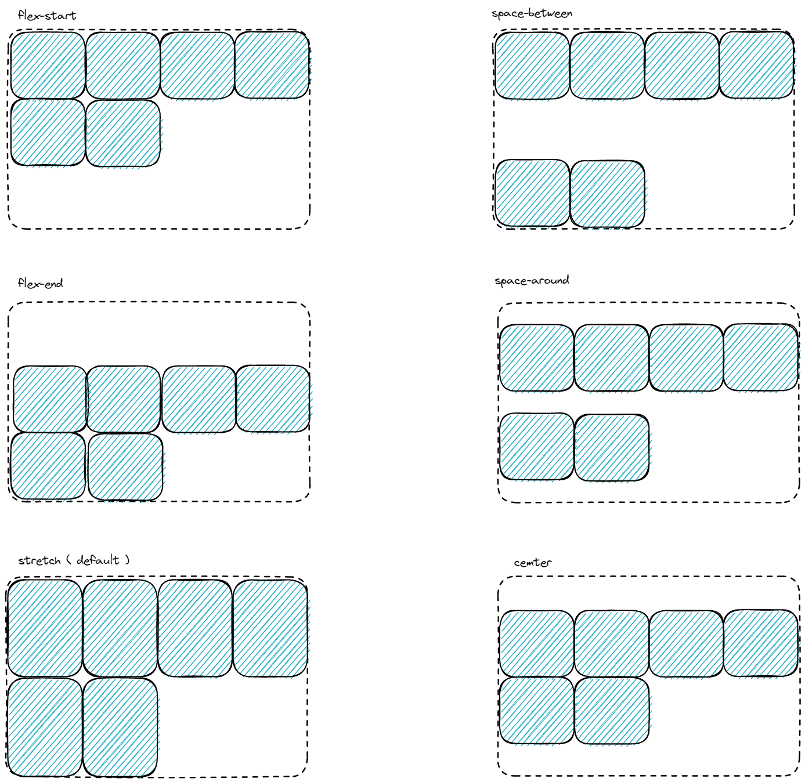

- `align-self` - 調整 <mark>各別項目</mark> 的對齊方式 ( `align-items` )

  ```css
  align-self: stretch; /* 自動拉伸 default */
  align-self: flex-start; /* 對齊上端 */
  align-self: flex-end; /* 對齊尾端 */
  align-self: center; /* 對齊中央 */
  align-self: baseline; /* 對齊準線 */
  ```

  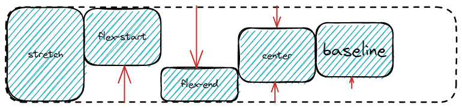

- `order` - 修改項目的顯示順序 (可用負數)

  - 數字越 <mark>大</mark> 者顯示越 <mark>後面</mark>

    

  - 在沒有指定的情況下，所有的 `order` 一律視為 `0`

- `flex-grow` - 自動延伸 flex 項目的寬度，填滿容器中指定比例的剩餘空間

  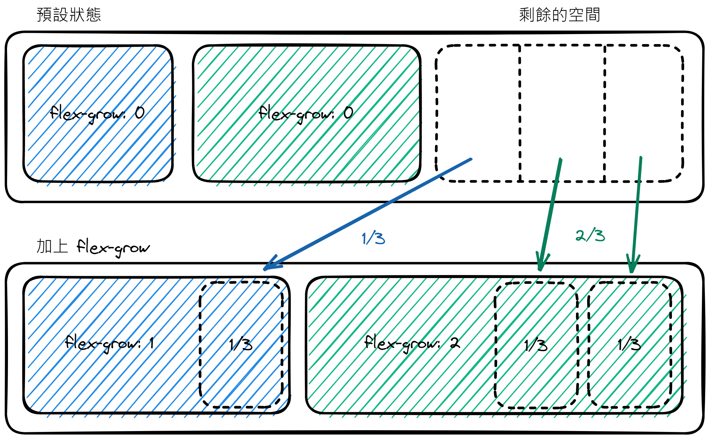

  - `flex-grow` 的預設值為 0，也就是不會自動拉伸

  - 最常使用 `flex-grow: 1;` 將剩餘空間平均分配下去，也就是會依照原比例

    - 所有項目依照原比例自動延伸

      ```css
      .box {
        height: 80px;
        flex-grow: 1;
      }

      .box:nth-child(1) {
        width: 200px;
      }

      .box:nth-child(2) {
        width: 400px;
      }
      ```

      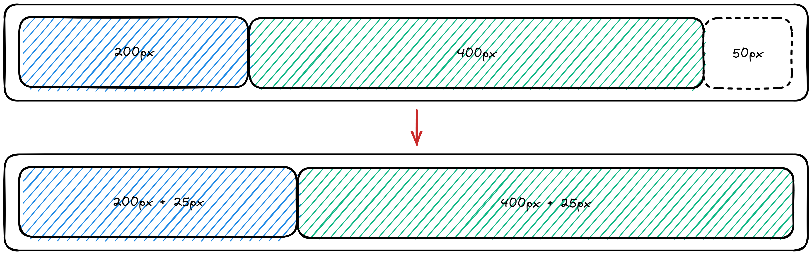

    - 指定特定項目延伸寬度填滿

      ```css
      .box {
        height: 80px;
      }

      .box:nth-child(1) {
        width: 200px;
      }

      .box:nth-child(2) {
        width: 400px;
        flex-grow: 1;
      }
      ```

      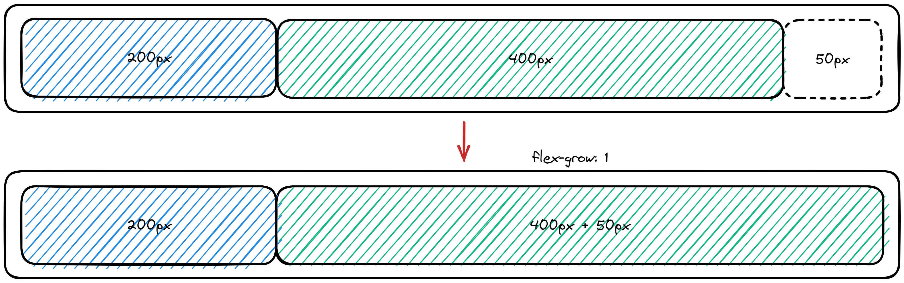

- `flex-shrink` - 設定項目的縮小比例

  - 當所有 flex 項目寬度，合計超過容器寬度時，利用 `flex-shrink` 就能用來設定縮小的比例

  - `flex-shrink` 預設值為 `1`，也就是依照原比例縮放到能塞進容器

    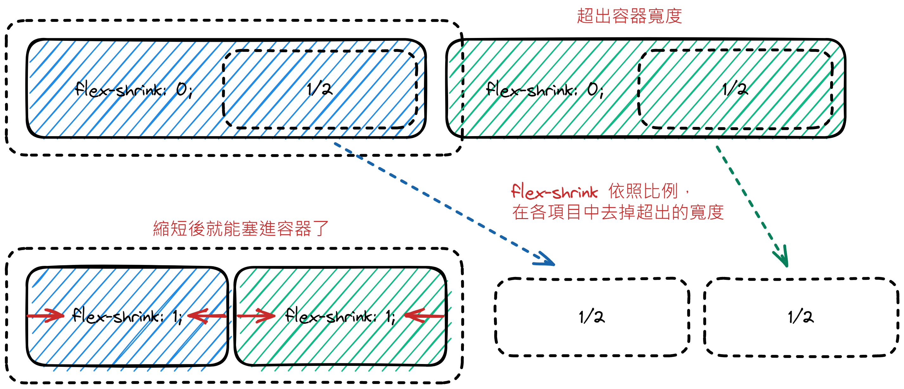

  - 常見的做法是設置 `flex-shrink: 0;` 固定某個項目的寬度，只去縮小其他項目

    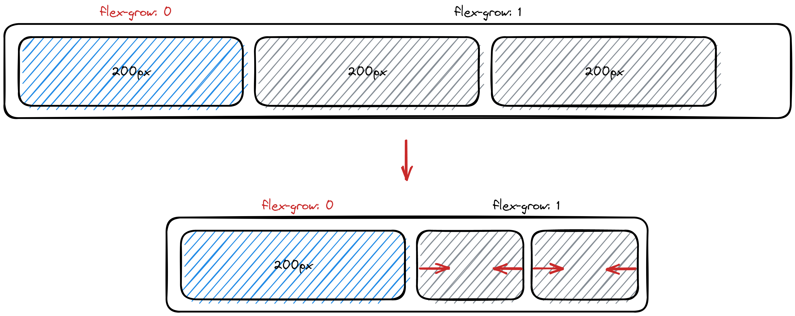

- `flex-basis` - 用來指定 flex 項目的 main-size ( 主軸方向的大小 )

  > 使用上有時會出現一些非預期的狀況，可以先用 `width` & `height` 就好

  - 主軸方向為 `row` 時相當於 `width`，`column` 時則相當於 `height`

    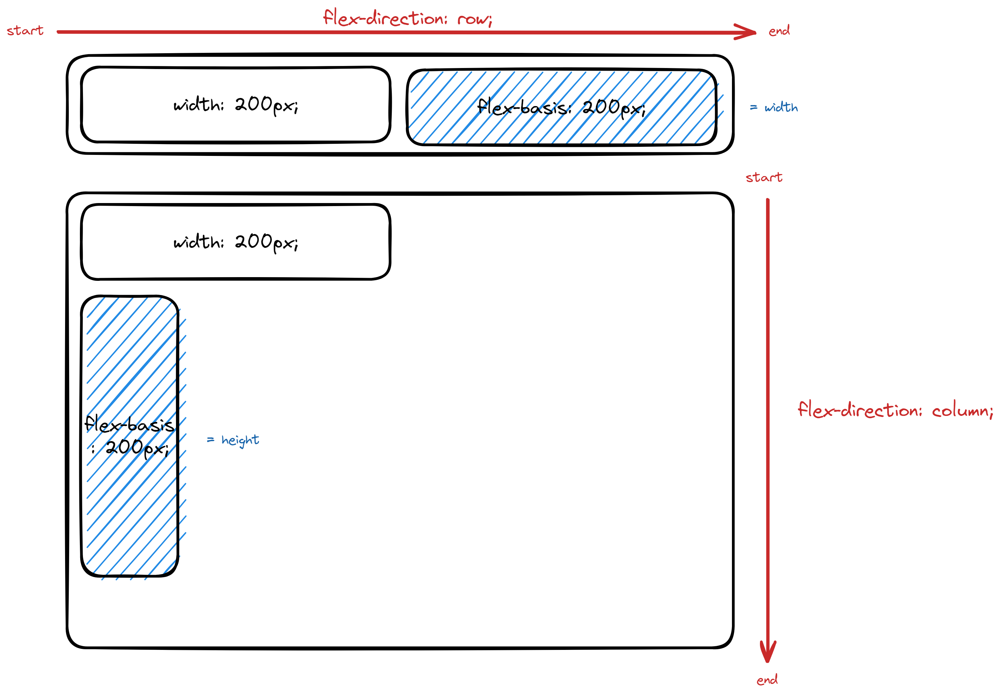

- `gap` - 在 flex 項目之間增加間距

  > `flex` 中使用 `gap` 較新，要注意一下支援度

- `flex` - `flex-grow` | `flex-shrink` | `flex-basis` 的簡寫

  ```css
  /*
    flex-grow: 1;
    flex-shrink: 0;
    flex-basis: 50px;
  */

  flex: 1 0 50px;
  ```

## [`grid`](https://www.w3schools.com/css/css_grid.asp)

- `grid` 解決了 `flex` 的一些缺點，也漸漸盛行 ( Ex. 不易控制多行的版面、容易造成許多巢狀的結構 )

  > `grid` 和 `flex` 各自有自己適合做的事情，並沒有絕對的好壞

  - 擅長多行顯示的版面，很適合用來建立整個頁面的整體框架

  - 能夠做出橫跨多欄 ( Ex. 合併儲存格 ) 的版面

  - 不需要為了版面設計將 HTML 變成巢狀結構

- Grid Layout Module 是將版面縱橫軸都畫上格線，再將內容填進網格中

  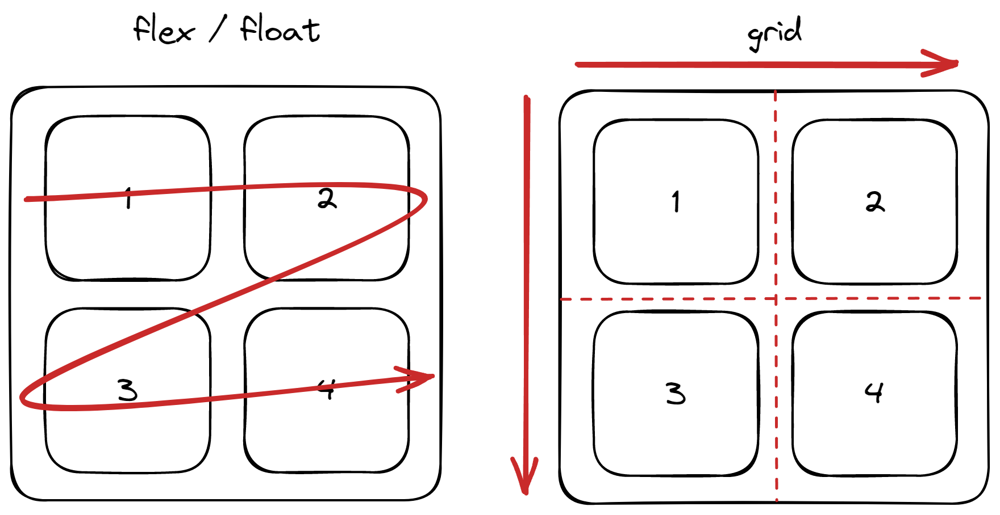

- 透過三個步驟建立 Grid Layout 的基本結構

  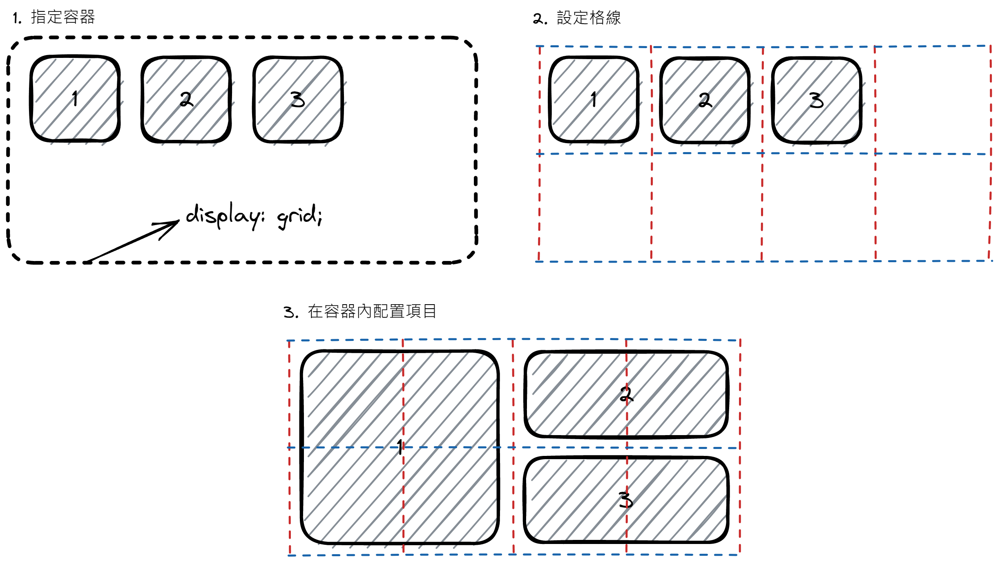

  1. 指定格線容器 ( Grid Container )
  2. 配合想要做出的版面，設定 橫向 ( row ) 和 縱向 ( column ) 的格線
  3. 在區塊內配置項目

1. 建立 Grid 容器

   > 由於 grid container 預設為 `overflow: visible;`，因此須小心內容是否有超出容器

   ```css
   display: grid | inline-grid;
   ```

   - `gap` | `row-gap` | `column-gap` 去設置 layout 之間的間距

     ```css
     row-gap: 10px;
     column-gap: 15px;

     /* row-gap (10px) column-gap (15px) */
     gap: 10px 15px;
     /* row-gap、column-gap (10px) */
     gap: 10px;
     ```

2. 配合想要做出的版面，設定 橫向 ( row ) 和 縱向 ( column ) 的格線

   - `grid-template-rows` & `grid-template-columns` 分別定義各欄位

     > 設置幾個 value 就會有幾個欄位

     - `none` (default) - 在需要的時候才自動建立

     - `auto` - 依照 grid 容器 & grid 項目的大小自動調整

     - `max-content` - 由 row 或 column 中最大的項目之大小為基準

     - `min-content` - 由 row 或 column 中最小的項目之大小為基準

     - 寬度單位 ( Ex. `px`、`%` ... )

   - `grid-template` - `grid-template-rows` + `grid-template` 或 `grid-template-areas` 的縮寫

     ```css
     /*
        grid-template-rows: repeat(5fr);
        grid-template-columns: repeat(2fr);
      */

     grid-template: repeat(5fr) / repeat(2fr);
     ```

   - `grid-auto-rows` & `grid-auto-columns` 自動設置欄位大小

     - 只會影響沒有設置大小的 grid 項目

     - 使用範例

       ```css
       /* 每新增一個 column 他都會是 50px */
       grid-auto-columns: 50px;

       /* 每新增一個 row 他都會是 50px */
       grid-auto-rows: 50px;
       ```

     - 屬性值

       - `auto` (default) - 依據容器大小自動分配

       - `fit-content` - 使用自己內容大小

       - `max-content` - 使用 columns 或 rows 中內容最大的大小

       - `min-content` - 使用 columns 或 rows 中內容最小的大小

       - `minmax(min, max)` - 最小至為 min，最大至 max

       - 單位 (Ex. `%`、`px` ...)

   - `grid-auto-flow` - 決定欄位增加時自動填入容器的方式

     - 屬性值

       - `column` - 作為一個新的 column ✅

       - `row` - 作為一行新的 row ✅

       - `dense` - 塞進任何空位

       - `row-dense` - 優線填滿 row 中的空位

       - `column-dense` - 優線填滿 column 中的空位

   - `grid` - 為以上的縮寫

     ```css
     /* 按照以下順序 */
     /*
        grid-template-rows
        grid-template-columns
        grid-template-areas
        grid-auto-rows
        grid-auto-columns
        grid-auto-flow
      */

     /* 預設值 */
     grid: none none none auto auto row;
     ```

   - grid 特殊單位 & 方法

     - `fr` - 代表 grid 容器所剩餘的空間 (隨著容器大小調整而變化)

        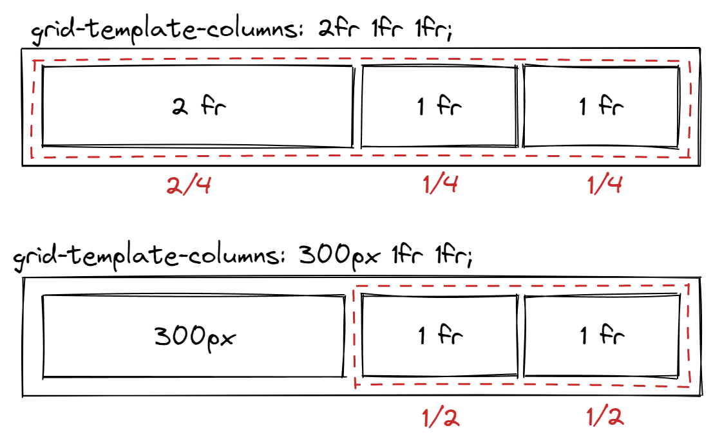

     - `repeat(次數, 規律)` - 建立重複規律

       ```css
       /* grid-template-columns: 1fr 1fr 1fr 1fr; */
       grid-template-columns: repeat(4, 1fr);

       /* grid-template-columns: 1fr 2fr 1fr 2fr; */
       grid-template-columns: repeat(4, 1fr 2fr);

       /* grid-template-columns: 400px 1fr 1fr 1fr 2fr; */
       grid-template-columns: 400px repeat(3, 1fr) 2fr;
       ```

     - [`minmax(min, max)`](https://developer.mozilla.org/en-US/docs/Web/CSS/minmax) - 定義寬度區間，最小至為 min，最大至 max

       ```css

       ```

   - 其他常用方法

     - `min()` - 使用最小值

       ```css
       /* 假設現在 100vw 為 1000px */
       width: min(200px, 100vw); /* 200px */
       ```

     - `max()` - 使用最大值

       ```css
       /* 假設現在 100vw 為 200px */
       width: min(1000px, 100vw); /* 1000px */
       ```

3. 在區塊內配置項目

   - 首先了解 Grid Lines

     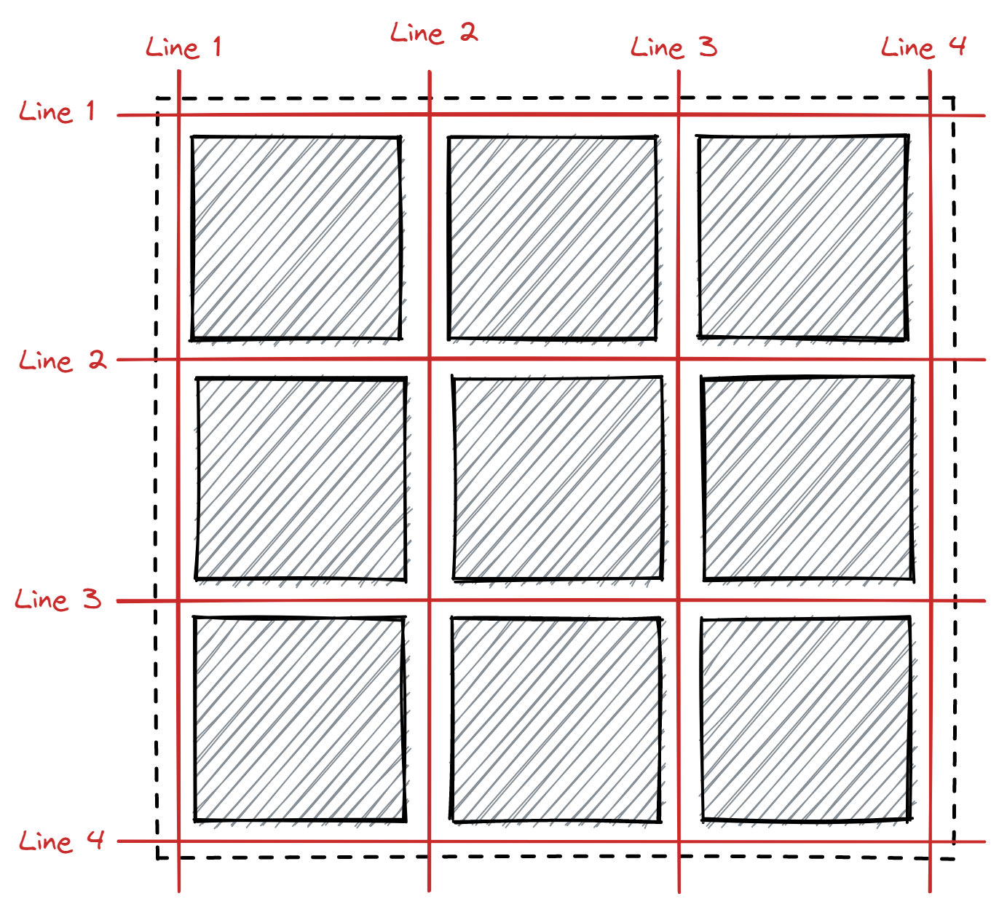

   - `grid-column-start`、`grid-column-end` 來決定所橫跨的 `columns`

   - `grid-row-start`、`grid-row-end` 來決定所橫跨的 `rows`

   - 屬性值 (可用負數)

     ```css
     grid-xxx-yyy: auto (default) | span n | grid-line;
     ```

     - `auto` (default) - 照著原本的流向走

     - `span n` - 定義要延伸幾個欄位

       ```css
       /* 從 row 1 開始，跨越 2 個 rows */
       grid-row-start: 1;
       grid-row-end: span 2;
       ```

     - `grid-line` - 定義從 line x ~ line y

       ```css
       /* 從 line 1 開始，到 line 3，也就是跨越 2 個 rows */
       grid-row-start: 1;
       grid-row-end: 3;
       ```

   - `grid-row` & `grid-column` 簡化上述的寫法

     ```css
     /* grid-column-start / grid-column-end */
     grid-column: 1 / span 2;

     /* grid-row-start / grid-row-end */
     grid-row: 1 / span 2;
     ```

     - 演示圖

        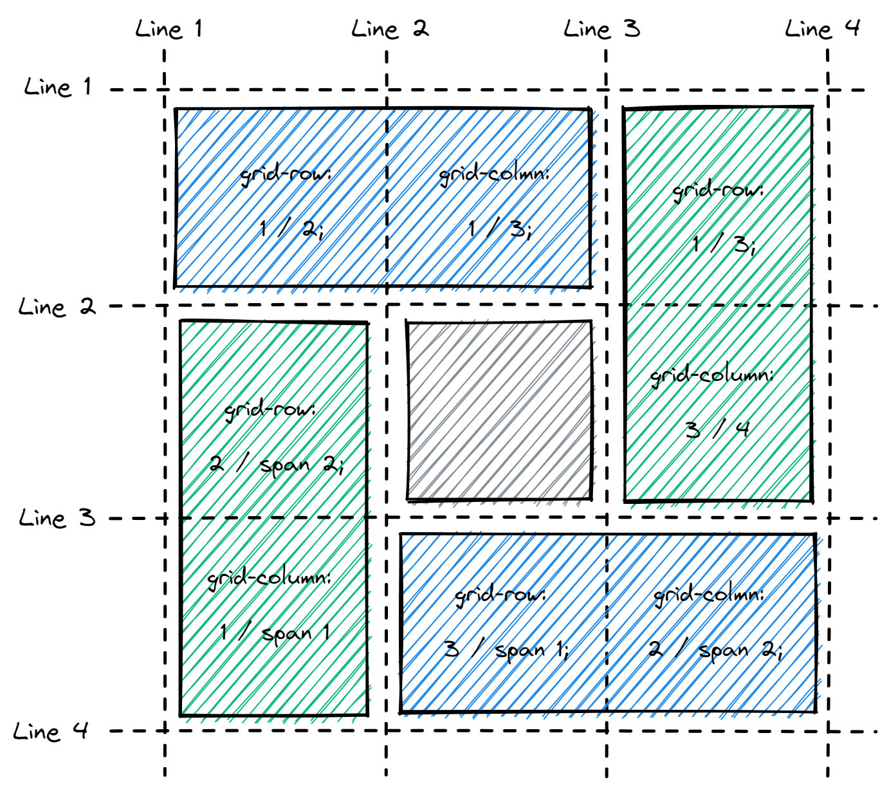

   - `grid-area` 可以更加簡化

     ```css
     /* 
       grid-row-start /
       grid-column-start /
       grid-row-end /
       grid-column-end
     */

     /* 從 row 1 & column 1 開始，跨越 2 rows & 3 columns*/
     grid-area: 1 / 1 / span 2 / span 2;
     ```

- [`grid-template-areas`](https://www.w3schools.com/cssref/pr_grid-area.php) 定義區塊名稱的方式撰寫，畫好格線後，將命名好的區塊填入欄位中

  > 使用 `.` 代表沒有名字的欄位

  ```html
  <style>
    .container {
      /* 分割欄位 */
      display: grid;
      grid-template-rows: 100px 1fr 100px;
      grid-template-columns: 200px 1fr 200px;

      /* 定義命名區塊所要佔據的欄位 */
      grid-template-areas:
        "header header header"
        "side1 main side2"
        "footer footer footer";
    }

    /* 綁定對應的區塊名稱 */
    .header {
      grid-area: header;
    }

    .side1 {
      grid-area: side1;
    }
    .side2 {
      grid-area: side2;
    }
    .main {
      grid-area: main;
    }
    .footer {
      grid-area: footer;
    }
  </style>

  <div class="container">
    <header class="header"></header>
    <main class="main"></main>
    <aside class="side1"></aside>
    <aside class="side2"></aside>
    <footer class="footer"></footer>
  </div>
  ```

  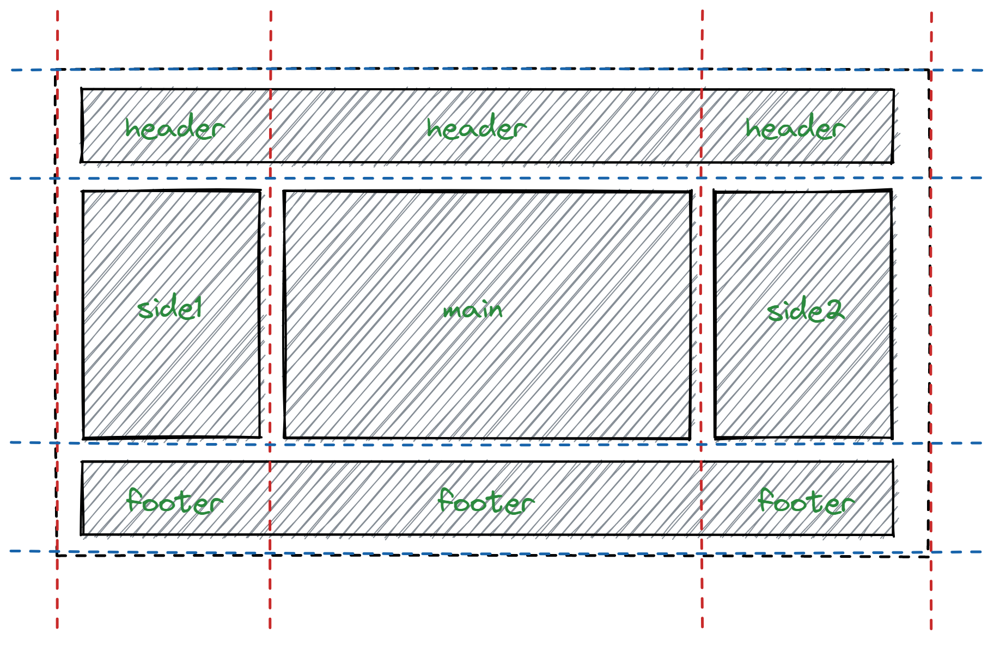

- 其他屬性 ( 和 flexbox 概念差不多 )

  | Property          | Description            | For ...   |
  | ----------------- | ---------------------- | --------- |
  | `justify-content` | 設定格線的橫向位置     | container |
  | `align-content`   | 設定格線的直向位置     | container |
  | `justify-items`   | 設定所有項目的橫向位置 | container |
  | `align-content`   | 設定所有項目的直向位置 | container |
  | `order`           | 改變自動配置的順序     | item      |
  | `justify-self`    | 設定項目本身橫向的位置 | item      |
  | `align-self`      | 設定項目本身直向的位置 | item      |
