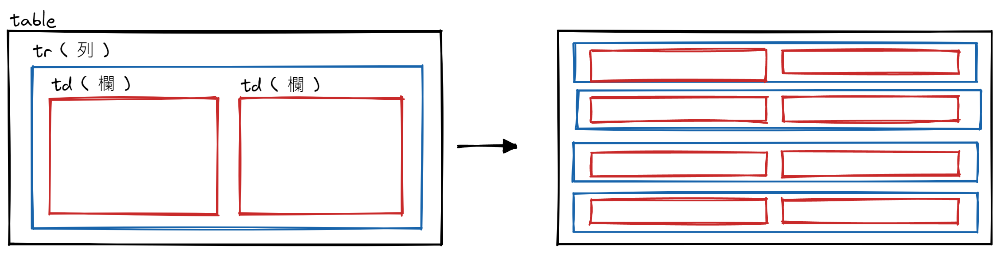

## Table

- 雖然使用 Table 切版是比較過去的作法，但在很多支援度較低的環境下仍會需要

  - Ex. Email、產生 PDF 的套件

- 基本結構

  ```html
  <!-- 整個表格區域 -->
  <table>
    <!-- 橫列 -->
    <tr>
      <!-- 直欄 / 直行 -->
      <td>第 1 欄</td>
      <td>第 2 欄</td>
    </tr>
  </table>
  ```

  

  - 欄位標題用 `<th>` 取代 `<td>`

    ```html
    <!-- 標題在上 -->
    <table>
      <tr>
        <th>標題 1</th>
        <th>標題 2</th>
      </tr>
      <tr>
        <td>內容 1</td>
        <td>內容 2</td>
      </tr>
    </table>

    <!-- 標題在左側 -->
    <table>
      <tr>
        <th>標題 1</th>
        <td>內容 1</td>
      </tr>
      <tr>
        <th>標題 2</th>
        <td>內容 2</td>
      </tr>
    </table>
    ```

- 可用 `<caption>` 來標記表格標題，預設會出現在表格上方

  ```html
  <table>
    <caption>
      Table Title
    </caption>
    <!-- ... -->
  </table>
  ```

- 增強表格結構，不會影響外觀，但結構較為完整，也好設置 CSS

  | Tag        | Group                                    |
  | ---------- | ---------------------------------------- |
  | `thead`    | 表格標題列                               |
  | `tbody`    | 表格資料列                               |
  | `tfoot`    | 表格最後一列元素                         |
  | `colgroup` | 表格直欄群組，方便用來做框線、背景色等等 |

- 增強欄位結構
