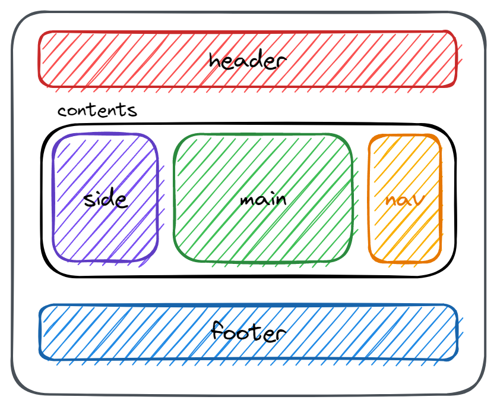

## float 練習

## position 練習

## flex 練習

- 二欄位

  ```html
  <header id="header"></header>

  <main id="main"></main>
  <aside id="side"></aside>

  <footer id="footer"></footer>
  ```

  

- 三欄位

  ```html
  <header id="header"></header>

  <div id="contents">
    <main id="main"></main>
    <aside id="side"></aside>
    <nav id="nav"></nav>
  </div>

  <footer id="footer"></footer>
  ```

  

- 網格狀版面

  ```html
  <header id="header"></header>

  <!-- width: 830px; -->
  <div class="card-wrapper">
    <!-- width: 200px; -->
    <div class="card"></div>
    <div class="card"></div>
    <div class="card"></div>
    <div class="card"></div>
    <div class="card"></div>
  </div>

  <footer id="footer"></footer>
  ```

- 小遊戲 - [flex froggy](https://flexboxfroggy.com/)

## `grid`

- grid 練習

  - 小遊戲 - [grid garden](https://cssgridgarden.com/)
