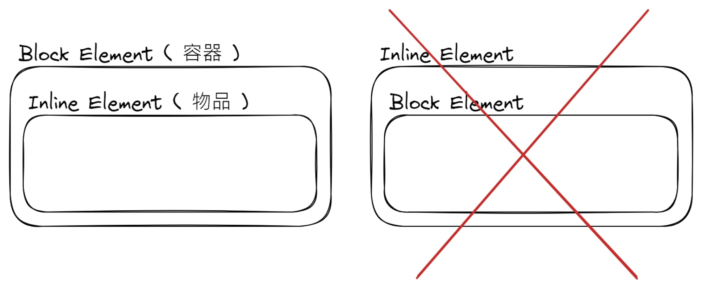

## HTML 標記規則

- 在元素巢狀過程中，必須遵循一些規範 ( [HTML5](https://www.w3.org/TR/2011/WD-html5-20110525/content-models.html) 非常複雜 )
- 可以使用 [W3C 的服務](https://validator.w3.org/) 做檢查
- 最主要分為了

  

  - block 元素 ( 可以想像成收到物品的容器 Ex. 段落、表格、列表 )
  - inline 元素 ( 可以想像成裝在容器中的物品 Ex. 文字、圖片 )

- HTML5 中增加了「通透性元素」的概念，也就是這些元素能繼承父元素的內容模型

  - `a` 為最具代表性的，讓他的使用上更加彈性
  - 以往 `a` 只能以 `div` 包住使用，因為他是 `inline` 元素，但在 HTML5 中變得可行
  - 使用範例

    ```html
    <div class="item">
      <!-- 繼承 div 元素的內容模型，稱為區塊型連結 -->
      <a href="#">
        <div></div>
        <dl>
          <dt>商品名稱 xxxx</dt>
          <dd>商品說明文字 xxxxxxx</dd>
        </dl>
      </a>
    </div>
    ```

> <em>block 元素中可以放 inline 元素，反過來則不行</em>

## HTML 基本元素

| Block Elements  | Description                     | Side Note             |
| :-------------- | :------------------------------ | :-------------------- |
| `<h1>` ~ `<h6>` | heading (標題)                  | 分為 h1 ~ h6 的層級   |
| `<p>`           | paragraph (段落)                |                       |
| `<ul>`          | unordered list (不分順序的列表) | 搭配 `li` 使用        |
| `<ol>`          | ordered list (順序列表)         | 搭配 `li` 使用        |
| `<dl>`          | definition list (定義用列表)    | 搭配 `dt` & `dd` 使用 |
| `<table>`       | table (表格)                    | 搭配 `tr` & `td` 使用 |
| `<div>`         | document divisions (區分)       | 做任意範圍的群組化    |

| Inline Elements | Description       | Side Note                                             |
| :-------------- | :---------------- | :---------------------------------------------------- |
| `<a>`           | anchor (錨點)     | 三種連結 (頁內、站內、外部) + 特殊用途 (Ex. `mailto`) |
| ``         | image (圖片)      |                                                       |
| `<button>`      | button (按鈕)     | 有很多預設樣式需要處理 QQ                             |
| `<span>`        | span (無特殊意義) | 用來包裹其他任意 inline 元素                          |

| Special Elements | Description             | Side Note            |
| :--------------- | :---------------------- | :------------------- |
| `<br>`           | break (換行)            | 不要加太多，會空一片 |
| `<hr>`           | horizontal (分隔線)     | 偷懶用               |
| `<em>`           | emphasis (強調)         | 斜體 (inline)        |
| `<strong>`       | strong (突顯重點)       | 粗體 (inline)        |
| `<i>`            | italic (專業用語)       | 斜體 (inline)        |
| `<b>`            | bold (關鍵字、專有名詞) | 粗體 (inline)        |
| `<small>`        | small (註解或補充)      | 小一號 (inline)      |

> 原本的 `<div>` 區塊並沒有特殊含義，在 HTML5 新增了擁有特殊涵義的區塊元素。
> <br/>如果只是為了排版，用 `<div>` 或 `<span>` 就好，不要亂用 !
> | New Elements | Description (擁有特殊涵義) |
> | :----------- | :-------------------------------- |
> | `<header>` | 文件或區塊的開頭 ( 也可用於單篇內容 ) |
> | `<footer>` | 文件或區塊的結尾 ( 也可用於單篇內容 ) |
> | [`<main>`](https://developer.mozilla.org/zh-CN/docs/Web/HTML/Element/main) | 主要內容 ( 一個網頁只能有一個!! ) |
> | [`<section>`](https://developer.mozilla.org/zh-CN/docs/Web/HTML/Element/section) | 表示有章節標題、概要內容的一般內容區塊 |
> | [`<article>`](https://developer.mozilla.org/zh-CN/docs/Web/HTML/Element/article) | 表示單篇的 「獨立」 內容區塊 ( Ex. 商品、文章 ) |
> | [`<aside>`](https://developer.mozilla.org/zh-CN/docs/Web/HTML/Element/aside) | 與主要內容較無關聯，將其移除也沒關係的區塊 ( Ex. 相關連結 ) |
> | [`<nav>`](https://developer.mozilla.org/zh-TW/docs/Web/HTML/Element/nav) | 表示網站的導航區塊 |
> | [`<figure>`](https://developer.mozilla.org/zh-CN/docs/Web/HTML/Element/figure) | 用來標記圖片、解說用聲音檔、影片、原始碼等引用的獨立內容，<br>搭配 `<figcaption>` 對引用的內容加上說明 |

## HTML5 元素分類模型

- 過去分類只分為 `block` 和 `inline` 兩種元素，HTML5 重新分為 7 大類 ( 會互相重疊 )
  | Special Elements | Description | Elements |
  | :--------------- | :---------------------- | :------------------- |
  | Metadata Content | `head` 中用來標記文檔 Meta 的元素 | `meta`、`script`、`style`、`link`、`title` ... |
  | Flow Content | 表示資料內容的所有元素 | |
  |Sectioning Content | 標題與概要等構成內容區塊的元素 | `section`、`article`、`aside`、`nav` |
  | Heading Content| 內容區塊的標題元素 | `h1` - `h6` |
  | Phrasing Content | 段落內元素 | `a`、`span`、`time`、`ruby` 等以往歸類於 inline 的元素 |
  | Embedded Content | 引用外部檔案使用的元素 | `img`、`iframe`、`audio`、`video`、`canvas`、`svg` |
  | Interactive Content | 超連結、表單等使用者能操作的元素 | `button`、`a`、`input`、`select`、`textarea` ... |

- 可簡化分為

  - 除了部分的 Metadata Content 之外，所有元素都算是 Flow Content
  - Heading Content 只會和 Flow Content 重疊
  - Embedded Content 同時是 Phrasing Content 也是 Flow Content

## 相對路徑 vs 絕對路徑

- 絕對路徑 - 以「http(s) 開始的完整網址 ( URL )」

  

- 相對路徑 - 「現在所在位置」&「目標檔案」之間的相對位置關係

  | Syntax | Description | Side Note                      |
  | :----- | :---------- | :----------------------------- |
  | `./`   | 同一階層    |                                |
  | `/`    | 下一階層    | 放在最前面代表 root ( 根目錄 ) |
  | `../`  | 上一階層    | example                        |

## 文檔結構練習

- 原文檔

  ```text
    An Tai's Portfolio

    我是一位日本老師，正邁向前端之路

    * 關於我
    * 專業技能
    * 作品集
    * 聯絡資訊

    /* ----------------- */

    <關於我>
    我是一個準備轉職前端工程師的日文老師，
    目前沒工作，在當快樂的家裡蹲!

    /* ----------------- */

    <專業技能>
    前端技能
      * HTML / CSS / JavaScript
      * JQuery / React.js / Next.js

    設計技能
      * PhotoShop / Adobe Illustrator / Adobe XD
      * Procreate / Figma

    /* ----------------- */

    <作品集>
    1. xxx 的小小店商
       [網站截圖]

    2. Todo List
       [網站截圖]

    3. 個人網站
       [網站截圖]

    /* ----------------- */

    <聯絡資訊>
    Email        : xxxx@gmail.com
    Line         : hello_world
    Number       : 0987654321

    Copyright © xxxx 2023
  ```
