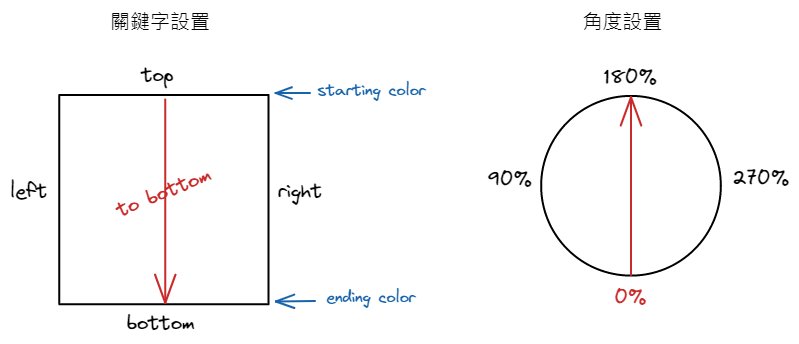
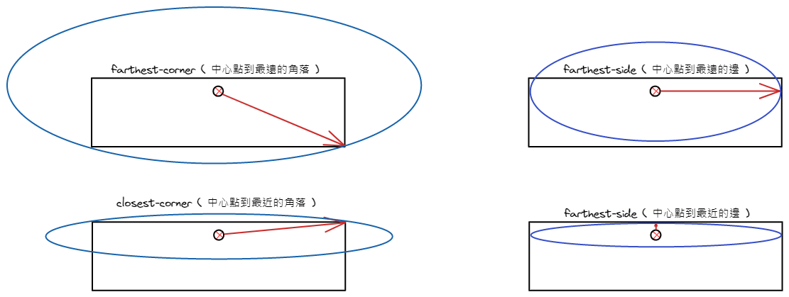

## 單位計算 ( `calc` )

> 記得算術符號左右藥空格

```css
width: calc(100% - 60px);
```

## 邊距 ( `margin` & `padding` )

- `margin` [ 單位 ] - 外邊距

  > 使用負數，會產生和其他相鄰元素重疊的效果

  ```css
  /* 上下左右 (1 個值) */
  margin: 15px;

  /* 上下 - 左右 (2 個值) */
  margin: 15px 10px;

  /* 上 - 左右 - 下 (3 個值) */
  margin: 15px 20px 10px;

  /* 上 - 右 - 下 - 左 (4 個值) */
  margin: 15px 5px 10px 10px;
  ```

  - `margin-top`、`margin-right`、`margin-bottom`、`margin-left` 可以做獨立設置

  - `auto` 值 - 占用所有剩餘的空間，讓自己在容器內 <mark>左右</mark> 置中
    > 對於 top bottom 無效
    ```css
    /* 以下兩者結果相同 */
    margin: auto;
    margin: 0 auto;
    ```

- `padding` [ 單位 ] - 內邊距

  ```css
  /* 上下左右 (1 個值) */
  padding: 15px;

  /* 上下 - 左右 (2 個值) */
  padding: 15px 10px;

  /* 上 - 左右 - 下 (3 個值) */
  padding: 15px 20px 10px;

  /* 上 - 右 - 下 - 左 (4 個值) */
  padding: 15px 5px 10px 10px;
  ```

  - `padding-top`、`padding-right`、`padding-bottom`、`padding-left` 可以做獨立設置

## 邊框 ( `border` )

- `border` [ 寬度 樣式 顏色 ]

  ```css
  border: 2px solid #000;
  ```

  - `border-top`、`border-right`、`border-bottom`、`border-left` 可以做獨立設置

- 也可獨立設置不同屬性 ( 參考 [w3school](https://www.w3schools.com/cssref/pr_border.php)、[相關文章](https://www.1keydata.com/css-tutorial/tw/border.php) )

  ```css
  /* 邊框寬度 */
  border-width: 2px;

  /* 邊框樣式 */
  border-style: dotted;

  /* 邊框樣式 */
  border-color: #000;
  ```

- `border-radius` [ 數值 ] - 圓角半徑

  > 也可以四個角分開設置

  ```css
  /* 統一設置四個角 */
  border-radius: 5px;

  /* 分開設置四個角 (左上 右上 右下 左下) */
  border-radius: 5p 10px 15px 20px;
  ```

  - 正圓 / 橢圓 - 四個角都設為 `50%` 以上

  - 以橢圓圓弧製作圓角

    - 將每個角落都設為橢圓 `橫軸半徑 / 縱軸半徑`

      ```css
      /* 同時設置四個橢圓 */
      border-radius: 50px / 20px;
      border-radius: 10px 20px 30px 40px / 20px 10px 20px 10px;
      ```

## 背景圖 ( `background` )

- `background-image` [ 背景圖 ]

  ```css
  background-image: url(img/bg.png);
  ```

- `background-repeat` [ 背景圖的重複方向 ]

  ```css
  /* 垂直、水平重複至填滿 (default) */
  background-repeat: repeat;

  /* 水平重複至填滿 */
  background-repeat: repeat-x;

  /* 垂直重複至填滿 */
  background-repeat: repeat-y;

  /* 不重複 */
  background-repeat: no-repeat;
  ```

- `background-position` [ 背景圖的顯示位置 (x y) ]

  ```css
  /* 靠左上顯示 (default) */
  background-position: left top;

  /* 加上數值 (離方位父層邊界的距離) */
  background-position: left 10px top 20px;

  /* 常用 */
  background-position: center;
  ```

  - 沒有給的值，會被自動設為 `center`
  - [參考 w3schools](https://www.w3schools.com/cssref/pr_background-position.php)

- `background-attachment` [ 背景固定方式 ]

  ```css
  /* 隨著視窗滾動 (default) */
  background-attachment: scroll;

  /* 固定在畫面上，不隨視窗滾動 */
  background-attachment: fixed;
  ```

- `background` 縮寫

  ```css
  /* 需照以下順序 */
  background-color: #ffffff;
  background-image: url("img_tree.png");
  background-repeat: no-repeat;
  background-attachment: scroll;
  background-position: right top;

  /* 用簡寫 (可省略不需要的，只要順序正確就好) */
  background: #ffffff url("img_tree.png") no-repeat scroll right top;
  ```

- `background-size` [ 背景顯示尺寸 ]

  > 不包含在縮寫當中，需額外設置

  ```css
  /* 原圖大小 (default) */
  background-size: auto;

  /* 尺寸 (寬 高) */
  background-size: 40px 80px;

  /* 父層元素的百分比 (寬 高) */
  background-size: 80% 50%;

  /* 讓圖片完整顯示 (不會變形) */
  background-size: contain;

  /* 讓圖片完整覆蓋，圖片可能會被拉伸或切割 (不會變形) */
  background-size: cover;
  ```

- 同時使用多張背景圖片
  > 第一個會在最上層，最後一個會在最下層
  <!-- prettier-ignore -->
  ```css
  /* 分別放在四個角落 */ 
  background:
      url(img/bg_frame01.png) left top no-repeat,
      url(img/bg_frame02.png) right top no-repeat,
      url(img/bg_frame03.png) left bottom no-repeat,
      url(img/bg_frame04.png) left bottom no-repeat,
  ```

## 文字修飾

- `text-shadow` - 文字陰影

  - 水平位移 x | 垂直位移 y | 模糊強度 | 陰影色

    ```css
    h1 {
      text-shadow: 1px 1px 2px #307657;
    }
    ```

  - 可用 `,` 分隔設定重影效果

- ⚠️ `text-stroke` - 文字描邊

  - 加在文字內側，因此字體需有一定大小才看得到

  - 為 `text-stroke-width` 和 `text-stroke-color` 的簡寫

    ```css
    -webkit-text-stroke: 1px #000;
    ```

- ⚠️ `background-clip` - 做文字背景效果

  - `background-clip` - 用來設定背景圖的裁切區域，加上 `-webkit-` 並指定為 `text`

    ```CSS
    background: url(./bg.jpg) center center no-repeat;
    -webkit-background-clip: text;
    color: transparent; /* 將文字背景設為透明 */
    ```

## 元素修飾

- `box-shadow` - 元素陰影

  - 水平位移 x | 垂直位移 y | 模糊強度 | 擴散強度 (可省) | 陰影色 | 內側指定 inset (可省)

    > 加上多層陰影可以增加柔順度 (用 `,` 加上重影)

    ```css
    h1 {
      box-shadow: 0 0 10px rgba(0, 0, 0, 0.5);
    }
    ```

## 漸層 ( 歸類於 `background-image` )

- `linear-gradient` - 線性漸層

  - 方向 & 角度 | 顏色端點 | 顏色端點 ...

    ```css
    background: linear-gradient(to right, #f00, #fff);
    ```

    - 方向 & 角度 - `to` 方向 | 數值 `deg`

      

    - 顏色端點 - 顏色 位置

  - `radial-gradient` - 放射狀漸層

    - 形狀 & 尺寸 & 中心位置 | 顏色端點 | 顏色端點 ...

      - 形狀 ex. `ellipse`、`circle`
      - 尺寸 ex. `farthest-corner`、`closest-corner`、`farthest-side`、`closest-side`

        

      - 中心位置 ex. `at <center、left、right、top、bottom、數值>`

      - 顏色端點 - 顏色 位置

  - `repeating-linear-gradient` - 重複線性漸層

    - 用法和 `linear-gradient` 相同

    - 可以做出條文效果

  - `repeating-radial-gradient` - 重複放射狀漸層

    - 用法和 `radial-gradient` 相同

## 濾鏡

- `filter` - 設定圖片或背景圖的濾鏡處理

  ```css
  filter: brightness(50%);
  ```

  - `grayscale` ( 灰階 ) - 0% 為原圖，100% 為黑白
  - `sepia` ( 懷舊 ) - 0% 為原圖，100% 為單一褐色系
  - `contrast` ( 對比 ) - 100% 為原圖，往上提高，往下縮小
  - `brightness` ( 亮度 ) - 100% 為原圖，往上變亮，往下變暗
  - `saturate` ( 色彩飽和度 ) - 100% 為原圖，往上增豔，往下降低
  - `hue-rotate` ( 色相旋轉 ) - 旋轉色相盤，0deg 為原圖，360deg 回到原點
  - `invert` ( 負片 ) - 0% 為原圖，100% 為明暗相反、顏色完全反轉成補色
  - `opacity` ( 透明度 ) - 100% 為不透明，0% 完全透明

    > 在某些瀏覽器上執行效率比 `opacity` 屬性佳

  - `blur` ( 模糊 ) - 值 ( 長度單位 ) 越大，程度越強

    > 不可使用 %

  - `drop-shadow` ( 輪廓陰影 ) - 使用上和 `box-shadow` 相同

    > `box-shadow` 會建立矩形區塊的陰影，而 `drop-shadow` 則會建立區塊本身輪廓的陰影

- `backdrop-filter`

  - 使用方式和 `filter` 相同，但所影響的是元素背後的區域畫面 > 常用來製作 glassmorphism 的效果
    ```css
    background: rgba(255, 255, 255, 0.25);
    box-shadow: 0 8px 32px 0 rgba(31, 38, 135, 0.37);
    backdrop-filter: blur(4px);
    border-radius: 10px;
    border: 1px solid rgba(255, 255, 255, 0.18);
    ```
