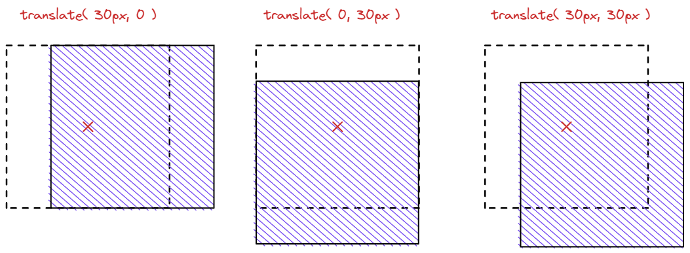
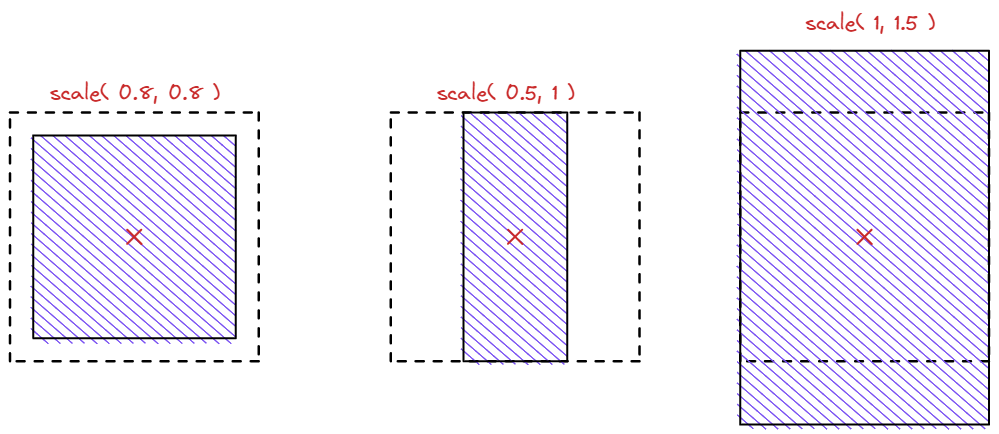
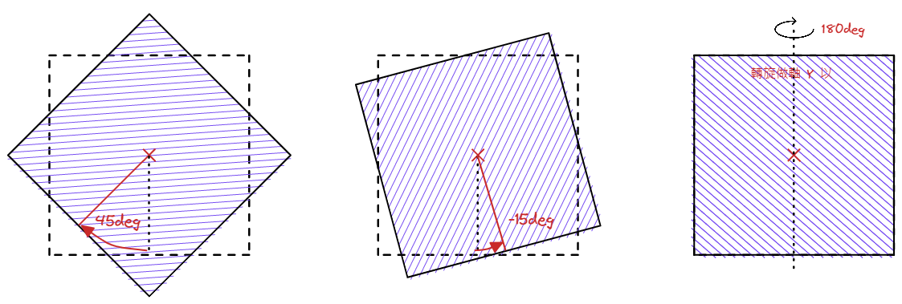
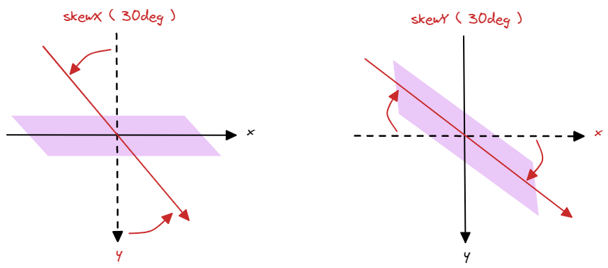

## transform

- `transform` - 用來使元素變形

  - `translate` / `translateX` / `translateY` - 平移

    > 單位 - 長度單位 ( `%` 為<mark>自己本身</mark>的寬度 !! )

    ```css
    .translate {
      transform: translate(X 軸移動距離, Y 軸移動距離);
      transform: translateX(X 軸移動距離);
      transform: translateY(Y 軸移動距離);
    }
    ```

    

  - `scale` / `scaleX` / `scaleY` - 縮放

    > 單位 - 純數值

    ```css
    .translate {
      transform: scale(X 軸縮放倍數, Y 軸縮放倍數);
      transform: scaleX(X 軸縮放倍數);
      transform: scaleY(Y 軸縮放倍數);
    }
    ```

    

  - `rotate` / `rotateX` / `rotateY` - 旋轉

    > 單位 - deg

    ```css
    .translate {
      transform: rotate(旋轉角度);
      transform: rotateX(以 X 軸反轉的角度);
      transform: rotateY(以 Y 軸反轉的角度);
    }
    ```

    

  - `skew` / `skewX` / `skewY` - 傾斜

    > 單位 - deg

    ```css
    .translate {
      transform: skew(往 X 軸的傾斜角度, 往 Y 軸的傾斜角度);
      transform: skewX(往 X 軸的傾斜角度); /* 逆時針 */
      transform: skewY(往 Y 軸的傾斜角度); /* 順時針 */
    }
    ```

    

- `transform-origin`: 調整變形原點 ( 以左上角為起點 )

  > 預設為正中央 ( 50%, 50% )

  ```css
  transform-origin: 0, center;

  /* transform-origin: x 軸位置, Y 軸位置; */
  /* X 軸位置 - % | 數值 | left | center | right */
  /* Y 軸位置 - % | 數值 | top | center | bottom */
  ```

- 3D ( Z 軸 )

## transition

> 設置於要變化的元素本身

- `transition` - 在原本瞬間變化的動畫上加上漸變

  > ⚠️ - 有些屬性不適用漸變 Ex. `display: block` -> `display: none`

  ```css
  transition: 1s color linear 0.5s;

  /* 為以下介紹之屬性的縮寫 */
  /* transition: 變化所需時間 [屬性] [變化方式] [延遲時間]; */
  ```

- `transition-duration` ( `s` / `ms` ) - 變化所需時間

- `transition-property` ( `all` / `none` / 屬姓名 ) - 要變化的屬性

- `transition-timing-function` - 變化方式

  - `ease` ( default ) - 平緩開始，中間加速，平緩結束

  - `linear` - 等速

  - `ease-in` - 緩慢開始

  - `ease-out` - 緩慢結束

  - `ease-in-out` - 緩慢開始，緩慢結束

  - [`cubic-bezier()`](https://cubic-bezier.com/#.17,.67,.83,.67) - 自訂

- `transition-delay` ( `s` / `ms` ) - 延遲時間

## animation

- `animation` ( 任意字串 / `none` ( default ) ) - 將元素設為關鍵影格 ( `keyframe` )

  ```css
  animation: fadeIn 1s infinite alternate;

  /* 為以下介紹之屬性的縮寫 */
  /* animation: 動畫名稱 播放時間 [變化方式] [延遲時間] [播放次數] [播放方向] [播放前後的樣式]; */
  ```

  - `animation-name`: 關鍵影格 ( `@keyframes` ) 所宣告的名稱

  - `animation-duration` ( `s` / `ms` ) - 播放 1 次所需時間

  - `animation-timing-function` - 變化方式

    - `ease` ( default )、`linear`、`ease-in`、`ease-out`、`ease-in-out`、`cubic-bezier()`

  - `animation-delay` ( `s` / `ms` ) - 延遲多久開始播放

  - `animation-iteration-count` ( `1` ( default ) / `infinite` ) - 播放次數

  - `animation-direction` - 播放方向

    - `normal` ( default ) - 正常播放

    - `reverse` - 反向播放

    - `alternate` - 正常播放開始，接著正反向輪流播放

    - `alternate-reverse` - 反向播放開始，接著正反向輪流播放

  - `animation-fill-mode` - 播放前後的樣式

    - `none` ( default ) - 不指定

    - `backwards` - 停在 0% 的狀態

    - `forwards` - 停在 100% 的狀態

    - `both` - `backwards` 和 `forwards` 兩者適用

- `@keyframes` 函數 - 定義動畫內容

  ```css
  animation: fadeIn 1s;

  @keyframes fadeIn {
    0% {
      opacity: 0;
    }
    ,
    100% {
      opacity: 1;
    }
  }

  /*
    @keyframes fadeIn {
      0% {
        屬性: 值; (開始時的樣式)
      }
      ,
      100% {
        屬性: 值; (結束時的樣式)
      }
    }
  */
  ```

  - `0%` 可省略

  - 可在 `0%` & `100%` 之間自由加上斷點，以 `,` 隔開

  - 可將 `0%` 改為 `from` 和 `100%` 改為 `to`

- 和 `transition` 的比較

  > 可自行決定使用 `transition` 或 `animation`

  - `transition`

    - 只能做出從開始變化到結束樣式的簡單變化

    - 只能顯示一次，無法重複播放

    - 需透過使用者互動來觸發，無法自行啟動

    - 可搭配 `:hover` 等狀態做出往返效果

  - `animation`

    - 除了開始和結束樣式，可以追加關鍵影格做出複雜的動畫

    - 不只顯示 1 次，可設定自動重複播放、反向播放、重新播放

    - 不須使用者行為，可以在頁面載入時就進行播放

    - `:hover` 等狀態要觸發時，需手動設定往返效果
