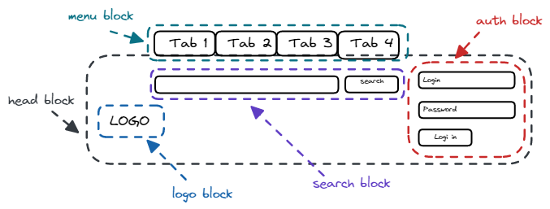
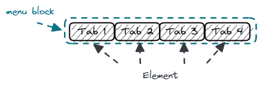
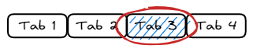

## B (Block) E (Element) M (Modifier) 命名設計模式

- 一種 class 命名的設計模式，優勢為可以由 class 名稱就能知道它們彼此間的依賴關係
- 避免命名衝突、不易管理擴充，能解決常常需要回頭確認相依關係的問題

  ```html
  <!-- 傳統命名 -->
  <ul class="menu">
    <li class="item active"><a href="#"></a></li>
    <li class="item"><a href="#"></a></li>
  </ul>

  <!-- 使用 BEM 的方式命名 -->
  <div class="product">
    <div class="menu">
      <li class="menu__item menu__item--active"><a href="#"></a></li>
      <li class="menu__item"><a href="#"></a></li>
    </div>
  </div>
  ```

  ```scss
  //  搭配 Sass 非常方便
  .media {
    &--full {
      // .media--full
    }
    &__submit {
      // .media__submit

      &--border {
        // .media__submit--border
      }
    }
  }
  ```

- 一個 class 應該最多包含 1 個 block ＆ 1 個 element，接下來的就用原本的命名方式
- 盡量讓 HTML 保持清楚易讀 (或是重新設立一個新的 block)

## Block 區塊

- `.block {...}`
- 在設計網站時，會設計幾個區塊 (Block) 出來，方便移動整個區塊到對應位置
  - ex. LOGO、選單、搜尋框、登入視窗等等
- 這時候我們就會用 class 命名他們區塊對應的語意

  - ex. `.logo`、`.menu`、`.search`、`.auth`

    

## Element 元素

- `.block__element{...}`
- 當某些元素被綁在區塊上，可以在區塊的 class 後面加上雙下底線 `__`
  - 辨識他是該區塊底下的元素
- 除了 HTML tag 外，如果是一個 CSS 組件也可把它視為元素 ( Element )

  - ex. 深入 menu 的區塊，可以看到下圖選單內有四個元素，<br>class 就會命名為 `.menu__item{...}`

    

## Modifier 修飾符

- `.block--modifier{...}`
- 當區塊或元素因為狀態而改變時，就在後面加上雙中線 `--` 來辨識它是修飾符
- 像是選單的部份，當被點選時為了要讓使用者了解該元素有被點選

  - 就會用 javascript 動態加入 class 為 `.menu__item--active`

    

- 其他使用 Modifier 的時機

  1. 滑鼠點選某個元素 ( Element ) 時<br> → 動態新增一個 `.element--Modifier` 來更換元素樣式
  2. 新增新按鈕時，可以設計 `.btn .btn--green .clearfix`<br> → 能了解 btn--green 是一個修飾符
  3. 滿版的搜尋區塊須為三分之一大小的區塊時<br> → 可以使用：`search search--1of3`
  4. 混合 component 時

     ```html
     <div class="footer">
       <div class="message message--inside-footer">
         <p class="message__text">Message</p>
       </div>
     </div>
     ```

- 當作為狀態管理時，仍建議使用 SMACCS 的命名規則
  - ex. `.is-active{...}`, `.is-valid{...}`, `.is-open{...}`

## 不需要 BEM 的情況

- 可以獨立成為一個 class 並提供複用性時

  - ex. `.clearfix{clear: both;}`、`.pull-left{float: left;}`

- 並不是所有的元素都要遵守 BEM 的規則
