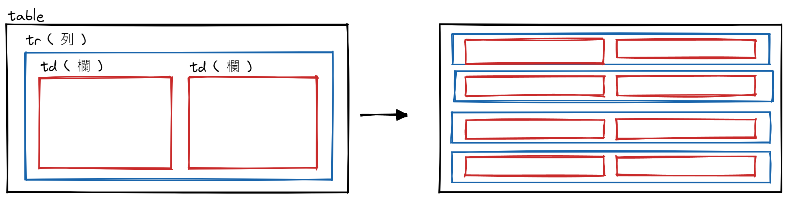
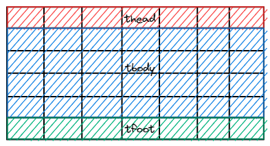

## Table

- 雖然使用 Table 切版是比較過去的作法，但在很多支援度較低的環境下仍會需要

  - Ex. Email、產生 PDF 的套件

- 基本結構

  ```html
  <!-- 整個表格區域 -->
  <table>
    <!-- 橫列 -->
    <tr>
      <!-- 直欄 / 直行 -->
      <td>第 1 欄</td>
      <td>第 2 欄</td>
    </tr>
  </table>
  ```

  

  - 欄位標題用 `<th>` 取代 `<td>`

    ```html
    <!-- 標題在上 -->
    <table>
      <tr>
        <th>標題 1</th>
        <th>標題 2</th>
      </tr>
      <tr>
        <td>內容 1</td>
        <td>內容 2</td>
      </tr>
    </table>

    <!-- 標題在左側 -->
    <table>
      <tr>
        <th>標題 1</th>
        <td>內容 1</td>
      </tr>
      <tr>
        <th>標題 2</th>
        <td>內容 2</td>
      </tr>
    </table>
    ```

- 可用 `<caption>` 來標記表格標題，預設會出現在表格上方

  ```html
  <table>
    <caption>
      Table Title
    </caption>
    <!-- ... -->
  </table>
  ```

- 增強表格結構，不會影響外觀，但結構較為完整，也好設置 CSS

  | Tag        | Group                                    |
  | ---------- | ---------------------------------------- |
  | `thead`    | 表格標題列                               |
  | `tbody`    | 表格資料列                               |
  | `tfoot`    | 表格最後一列元素                         |
  | `colgroup` | 表格直欄群組，方便用來做框線、背景色等等 |

  

  - 利用 `scope` 屬性增強欄位結構，技術儲存格標題以哪個方向顯示

    > 並不會影響外觀，但能讓瀏覽器更了解此表格 ( 或是方便於選擇器中使用 )

    - `scope="row"` - 橫列
    - `scope="column"` - 直欄

- 合併儲存格

  > 指定要合併的數量，並拿掉被合併的儲存格 (要小心移除)

  - `colspan` - 合併直欄的儲存格，也就是做橫向的合併

    ```html
    <tr>
      <td colspan="3">1</td>
      <!-- <td>2</td> -->
      <!-- <td>3</td> -->
    </tr>
    <tr>
      <td>4</td>
      <td>5</td>
      <td>6</td>
    </tr>
    ```

  - `rowspan` - 合併橫列的儲存格，也就是做縱向的合併

    ```html
    <tr>
      <td rowspan="2">1</td>
      <td>2</td>
      <td>3</td>
    </tr>
    <tr>
      <!-- <td>4</td> -->
      <td>5</td>
      <td>6</td>
    </tr>
    ```

  - `colspan` + `rowspan`

    ```html
    <tr>
      <td colspan="2" rowspan="2">1</td>
      <!-- <td>2</td> -->
      <td>3</td>
    </tr>
    <tr>
      <!-- <td>4</td> -->
      <!-- <td>5</td> -->
      <td>6</td>
    </tr>
    ```

## Form

- [`<form>`](https://www.w3schools.com/html/html_forms_attributes.asp) - 用來包住所有表單元素 Ex. `<input>`、`<select>`

  > 預設情況下，表單會在裡面的 `<button>` 被點擊時做提交

  - `id` - 定義表單名稱，常搭配 JavaScript 使用取得 `{name: value}`

  - `action` ( url ) - 決定表單被提交到的目的地 ( Server )

    > 沒有設置時，會預設為當前頁面

    ```html
    <form action="/action_page.php">
      <!-- ... -->
    </form>
    ```

  - [`target`](https://www.w3schools.com/tags/att_form_target.asp) - 決定目的地開啟的方式

  - `method` ( `get` ( default ) | `post` ) - 決定表單被提交的方式

    > 目前多使用 JavaScript 控制

    - `get` - 透過 URL 參數進行傳遞資訊 ( 任何人都能看到，因此不要用來傳遞私密資訊 )

      > 想像成沒有信封的明信片，地址和內容都裸露在外面

      ```html
      <!-- 主要用來傳遞參數取得資料 -->
      <form action="/action_page.php" method="get">
        <!-- ... -->
      </form>

      <!-- .../action_page.php?fname=John&lname=Doe -->
      ```

      > URL 的長度限制為 2048 個字元

    - `post` - 經過封包後，透過 HTTP Request Body 傳遞資訊 ( 較為安全 )

      > 想像信包在信封中，在信封上撰寫地址等註記，內容則在信封中無法從外部看到

      ```html
      <!-- 主要用來傳遞私密資訊取得私密資料或是進行存入 -->
      <form action="/action_page.php" method="post">
        <!-- ... -->
      </form>

      <!-- .../action_page.php -->
      ```

      > 沒有內容大小限制，可以傳遞大筆資料

  - `autocomplete` ( `on` ( default ) | `off` ) - 使用者輸入表單時是否跳出輸入過的內容

  - `novalidate` ( 本身為 boolean ) - 加上後，會防止表單提交時做任何驗證

    ```html
    <form action="/action_page.php" novalidate>
      <!-- ... -->
    </form>
    ```

- [Form Elements W3C](https://www.w3schools.com/html/html_form_elements.asp)

- [`<input>`](https://www.w3schools.com/tags/tag_input.asp)

  > 部分較新的欄位，若瀏覽器不支援，會顯示 `type="text"`

  | Element          | Definition                                         | Sample                                                                                |
  | ---------------- | -------------------------------------------------- | ------------------------------------------------------------------------------------- |
  | `text`           | 單行文字輸入                                       | `<input type="text" />`                                                               |
  | `password`       | 密碼輸入，顯示符號                                 | `<input type="password" />`                                                           |
  | `submit`         | 送出表單按鈕<br>( = `button` + `type` )            | `<input type="submit" value="Submit" />`<br>= `<button type="submit">Submit</button>` |
  | `reset`          | 重製表單鈕<br>( = `button` + `type` )              | `<input type="reset" value="Reset" />`<br>= `<button type="reset">Reset</button>`     |
  | `radio`          | 單選組 ( 透過 `name` 編組 )<br>-> 一組中只能選一個 | `<input type="radio" name="gender" value="female">`                                   |
  | `checkbox`       | 允許選取 0 或 多個選項                             | `<input type="checkbox" />`                                                           |
  | `button`         | 按鈕<br>( = `button` )                             | `<input type="button" value="Button" />`<br>= `<button type="button">Button</button>` |
  | `color`          | 顏色選取器                                         | `<input type="color" />`                                                              |
  | `date`           | 選擇日期                                           | `<input type="date" min="2000-01-02"/>`                                               |
  | `datetime-local` | 選擇時間 & 日期                                    | `<input type="datetime-local" />`                                                     |
  | `email`          | Email 輸入<br>-> 會檢查格式                        | `<input type="image" src="img_submit.gif" alt="Submit" width="48" height="48" />`     |
  | `image`          | 使用圖片作為送出按鈕入                             | `<input type="text" />`                                                               |
  | `file`           | 上傳文件入                                         | `<input type="file" />`                                                               |
  | `hidden`         | 隱藏欄位，用來加上一些想夾帶送出的內容             | `<input type="hidden" value="xxx" />`<br>= 在 `<input>` 加上 `hidden`                 |
  | `month`          | 選取年 & 月                                        | `<input type="month" />`                                                              |
  | `number`         | 選取數字 ( 小心使用 )器                            | `<input type="number" />`                                                             |
  | `range`          | 拖拉選取數字範圍器 ( 可透過 `step` 設置斷點 )      | `<input type="range" step="2" />`                                                     |
  | `search`         | 搜索框 (行為同 `text`)                             | `<input type="search" />`                                                             |
  | `tel`            | 輸入電話                                           | `<input type="tel" step="2" />`                                                       |
  | `time`           | 選取時間                                           | `<input type="time" />`                                                               |
  | `url`            | URL 輸入<br>-> 會檢查格式                          | `<input type="url" />`                                                                |
  | `week`           | 選取星期 & 年                                      | `<input type="week"  />`                                                              |

  | Attribute      | Definition                                       | Sample                                                                                              |
  | -------------- | ------------------------------------------------ | --------------------------------------------------------------------------------------------------- |
  | `value`        | 定義其初始值或顯示文字                           | `<input type="text" value="John" />`                                                                |
  | `readonly`     | 加上後將欄位設為唯讀<br>-> 仍會被提交            | `<input type="text" disabled>`                                                                      |
  | `disabled`     | 禁用此欄位，無法點選或輸入<br>-> 不會被提交      | `<input type="text" value="John" />`                                                                |
  | `size `        | 設置欄位寬度                                     | `<input type="text" size="50"/>`                                                                    |
  | `maxlength `   | 限制輸入字數                                     | `<input type="password" maxlength="8"/>`                                                            |
  | `min` & `max`  | 定義特定欄位的最大最小值                         | `<input type="date" max="1979-12-31" />`                                                            |
  | `multiple `    | 允許輸入或選擇多筆內容<br>( `email ` & `file` )  | `<input type="file" id="files" name="files" multiple />`                                            |
  | `pattern`      | 用 Regex 定義內容格式<br>加上 `title` 做錯誤提示 | `<input type="text" name="country_code" pattern="[A-Za-z]{3}" title="Three letter country code" />` |
  | `placeholder`  | 欄位提示文字                                     | `<input type="tel" name="phone" placeholder="123-45-678" />`                                        |
  | `required`     | 設為必填欄位                                     | `<input type="text"required>`                                                                       |
  | `autofocus`    | 頁面載入後自動對焦此欄位                         | `<input type="text" autofocus>`                                                                     |
  | `autocomplete` | 用 `on` 或 `off` 設置是否顯示輸入過的內容        | `<input type="email" autocomplete="off">`                                                           |

  > 以上驗證，若想提供使用者回饋，需使用 JavaScript

- `label` - 為多種表單元素加上標籤

  > 能增加可點選範圍，提升使用者體驗

  - 透過 `for` 屬性，連動對應的表單元素<br>-> `<label>` 中 `for` 值，須和 `<input>` 中 `id` 值相同

    ```html
    <div class="form-control">
      <label for="userEmail">Email</label>
      <input type="email" id="userEmail" name="userEmail" />
    </div>
    ```

  - 若將 `<input>` 包進 `<label` 中，可以省略 `for`

    ```html
    <!-- 可以用於一些特殊用途 (Ex. radio、checkbox) -->
    <label>
      我同意所有使用規則
      <input type="checkbox" />
    </label>
    ```

- `<select>` - 搭配 `<option>` 建立下拉選單

  ```html
  <label for="cars">Choose a car:</label>
  <select id="cars" name="cars" size="2">
    <option value="volvo">Volvo</option>
    <option value="saab" selected>Saab</option>
    <option value="fiat">Fiat</option>
    <option value="audi">Audi</option>
  </select>
  ```

  - `<option>` - 用來建立可點選的選項 ( 預設第一個選項會被選擇 )

    > 可加上 `selected` 來指定被預選的選項

  - `size` - 可設置展開一次所能看見的選項數量

  - `multiple` - 加上後能允許使用者作多選

- `<textarea>` - 建立多行文字輸入框

  ```html
  <textarea name="message" rows="10" cols="30">
    The cat was playing in the garden.
  </textarea>
  ```

  - `rows` - 指定顯示的行數 ( 常透過 CSS 的 `height` 設置 )

  - `cols` - 指定顯示的寬度 ( 常透過 CSS 的 `width` 設置 )

  - 可用 CSS 的 `resize` 來限制使用者調整輸入框大小

    > `<textarea>` 的預設值為 `both`

    - `none` - 不能拖拉大小
    - `vertical` - 只能縱向調整
    - `horizontal` - 只能橫向調整

- `<button>` - 建立一個可點擊的按鈕

  > 建議設置 type 來統一覆蓋各瀏覽器的預設值

  ```html
  <button type="button">Click Me!</button>
  ```

- 用 `<fieldset>` + `<legend>` 讓表單結構更為完善

  ```html
  <form>
    <fieldset>
      <legend>申請人</legend>
      <div class="form-control">
        <label for="name">姓名</label>
        <input type="text" id="name" />
      </div>
      <div class="form-control">
        <label for="email">Email</label>
        <input type="email" id="email" />
      </div>
    </fieldset>
  </form>
  ```

  - `fieldset` - 用來對表單進行分組

  - `legend` - 用來定義一組表單的標題

- `<datalist>` - 預先為 `<input>` 定義選項 (以下拉形式顯示)

  ```html
  <input list="browsers" />
  <datalist id="browsers">
    <option value="Internet Explorer"></option>
    <option value="Firefox"></option>
    <option value="Chrome"></option>
    <option value="Opera"></option>
    <option value="Safari"></option>
  </datalist>
  ```

  - `<datalist>` 中 `id` 值，須和 `<input>` 中 `list` 值相同

## Table & Form 樣式

<!-- TODO 後續新增 -->

- Table 相關樣式設置
- Form 和 Form Elements 的顯示外觀，會因不同瀏覽器而有所差異
